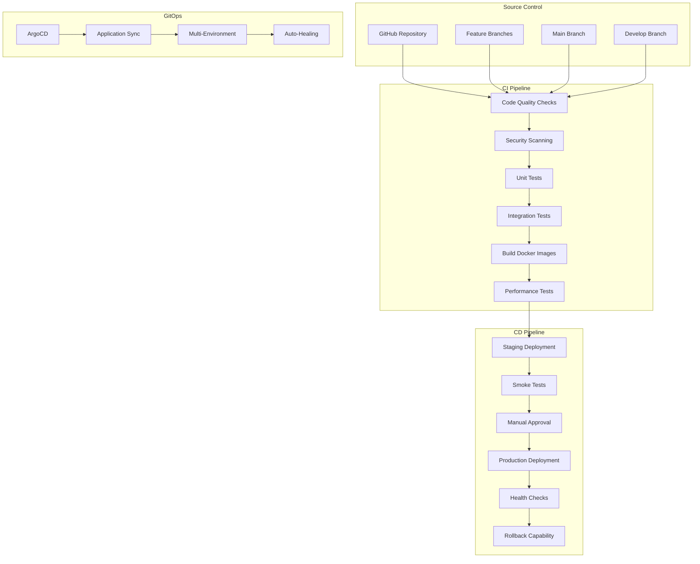

# 🏗️ Go Coffee CI/CD Architecture Design

## 🎯 Architecture Overview

The Go Coffee CI/CD pipeline is designed as a comprehensive, enterprise-grade system supporting 19+ microservices, AI agents, and infrastructure components with full automation, security, and observability.

## 🔄 Pipeline Architecture



## 🏢 Service Architecture

### **Core Business Services**
- **API Gateway**: Main entry point and routing
- **Auth Service**: Authentication and authorization
- **Order Service**: Order management and processing
- **Payment Service**: Payment processing and validation
- **Kitchen Service**: Kitchen operations and workflow
- **User Gateway**: User management and profiles

### **AI & ML Services**
- **AI Service**: Core AI functionality
- **AI Search**: Intelligent search capabilities
- **AI Arbitrage Service**: Trading and arbitrage algorithms
- **AI Order Service**: AI-enhanced order processing
- **LLM Orchestrator**: Language model management
- **MCP AI Integration**: AI integration layer

### **Infrastructure Services**
- **Security Gateway**: Security layer and policies
- **Communication Hub**: Inter-service communication
- **Market Data Service**: Financial data integration
- **DeFi Service**: Decentralized finance operations
- **Bright Data Hub**: External data integration
- **Redis MCP Server**: Redis management and caching

### **Data & Storage**
- **PostgreSQL**: Primary relational database
- **Redis**: Caching and session storage
- **Kafka**: Message streaming and event processing

## 🔒 Security Architecture

### **Multi-Layer Security**
1. **Code Security**: SAST, dependency scanning, secret detection
2. **Container Security**: Image scanning, vulnerability assessment
3. **Infrastructure Security**: IaC scanning, policy validation
4. **Runtime Security**: Monitoring, threat detection, compliance

### **Security Scanning Pipeline**
```yaml
Security Stages:
  - Static Code Analysis (SAST)
  - Dependency Vulnerability Scanning
  - Container Image Scanning
  - Infrastructure as Code Scanning
  - Dynamic Application Security Testing (DAST)
  - Compliance Validation
```

## 📊 Monitoring & Observability

### **Monitoring Stack**
- **Prometheus**: Metrics collection and storage
- **Grafana**: Visualization and dashboards
- **Jaeger**: Distributed tracing
- **AlertManager**: Alert routing and management

### **Key Metrics**
- **CI/CD Metrics**: Build time, success rate, deployment frequency
- **Application Metrics**: Response time, error rate, throughput
- **Infrastructure Metrics**: Resource utilization, availability
- **Security Metrics**: Vulnerability count, compliance status

## 🌍 Multi-Environment Strategy

### **Environment Hierarchy**
1. **Development**: Feature development and testing
2. **Staging**: Pre-production validation
3. **Production**: Live production environment
4. **DR (Disaster Recovery)**: Backup production environment

### **Deployment Strategies**
- **Blue-Green**: Zero-downtime deployments
- **Canary**: Gradual traffic shifting
- **Rolling**: Progressive service updates
- **Feature Flags**: Controlled feature rollouts

## 🔄 GitOps Workflow

### **ArgoCD Applications**
```yaml
Applications:
  - go-coffee-core: Core business services
  - go-coffee-ai: AI and ML services
  - go-coffee-infrastructure: Infrastructure components
  - go-coffee-monitoring: Observability stack
  - go-coffee-security: Security policies and tools
```

### **Sync Policies**
- **Automated Sync**: Staging environment
- **Manual Sync**: Production environment
- **Self-Healing**: Automatic drift correction
- **Pruning**: Orphaned resource cleanup

## 🚀 Deployment Pipeline Stages

### **Stage 1: Code Quality & Security**
- Linting and formatting checks
- Static code analysis
- Security vulnerability scanning
- License compliance validation

### **Stage 2: Testing**
- Unit tests with coverage reporting
- Integration tests with real dependencies
- Performance and load testing
- End-to-end testing

### **Stage 3: Build & Package**
- Multi-architecture Docker builds
- Container security scanning
- Artifact signing and verification
- Registry push with metadata

### **Stage 4: Staging Deployment**
- Automated deployment to staging
- Smoke tests and health checks
- Performance validation
- Security testing

### **Stage 5: Production Deployment**
- Manual approval gates
- Blue-green deployment strategy
- Gradual traffic shifting
- Monitoring and alerting

### **Stage 6: Post-Deployment**
- Health monitoring
- Performance tracking
- Error rate monitoring
- Automatic rollback triggers

## 🔧 Configuration Management

### **Environment Variables**
- Service-specific configurations
- Database connection strings
- API keys and secrets
- Feature flags and toggles

### **Secrets Management**
- Kubernetes secrets for sensitive data
- External secret management integration
- Automatic secret rotation
- Audit logging for secret access

## 📈 Scalability & Performance

### **Horizontal Scaling**
- Kubernetes HPA (Horizontal Pod Autoscaler)
- Custom metrics-based scaling
- Predictive scaling based on patterns
- Resource optimization

### **Performance Optimization**
- Container image optimization
- Resource request/limit tuning
- Caching strategies
- Database optimization

## 🔄 Disaster Recovery

### **Backup Strategy**
- Database backups with point-in-time recovery
- Configuration backups
- Container image backups
- Infrastructure state backups

### **Recovery Procedures**
- Automated failover mechanisms
- Cross-region replication
- Recovery time objectives (RTO)
- Recovery point objectives (RPO)

## 📚 Compliance & Governance

### **Compliance Frameworks**
- SOC 2 Type II
- PCI DSS
- GDPR
- ISO 27001

### **Governance Policies**
- Code review requirements
- Deployment approval workflows
- Security policy enforcement
- Audit trail maintenance

## 🔮 Future Enhancements

### **Planned Features**
- Multi-cloud deployment support
- Advanced AI/ML pipeline integration
- Chaos engineering automation
- Advanced security analytics
- Cost optimization automation

This architecture provides a robust, scalable, and secure foundation for the Go Coffee platform's CI/CD operations.
