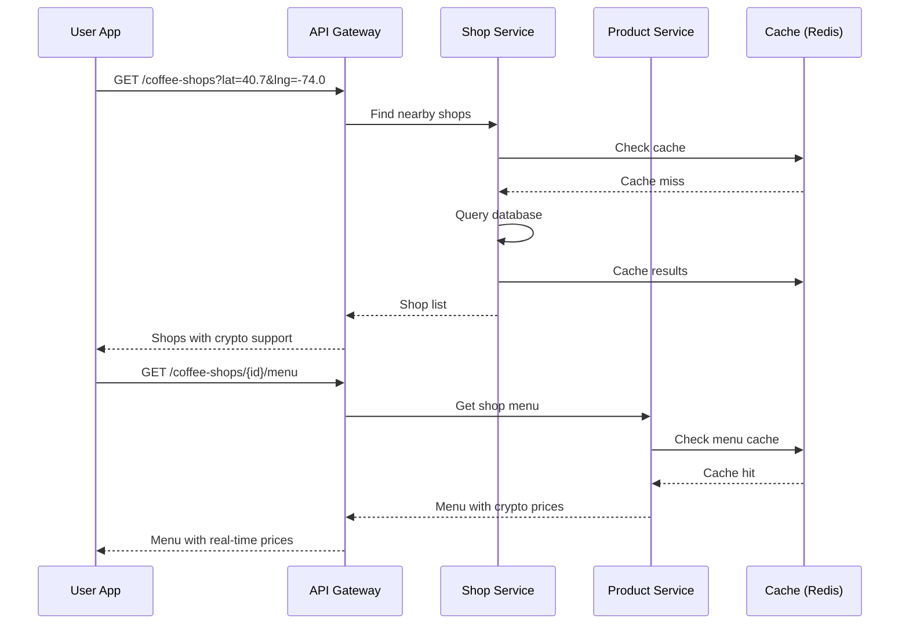
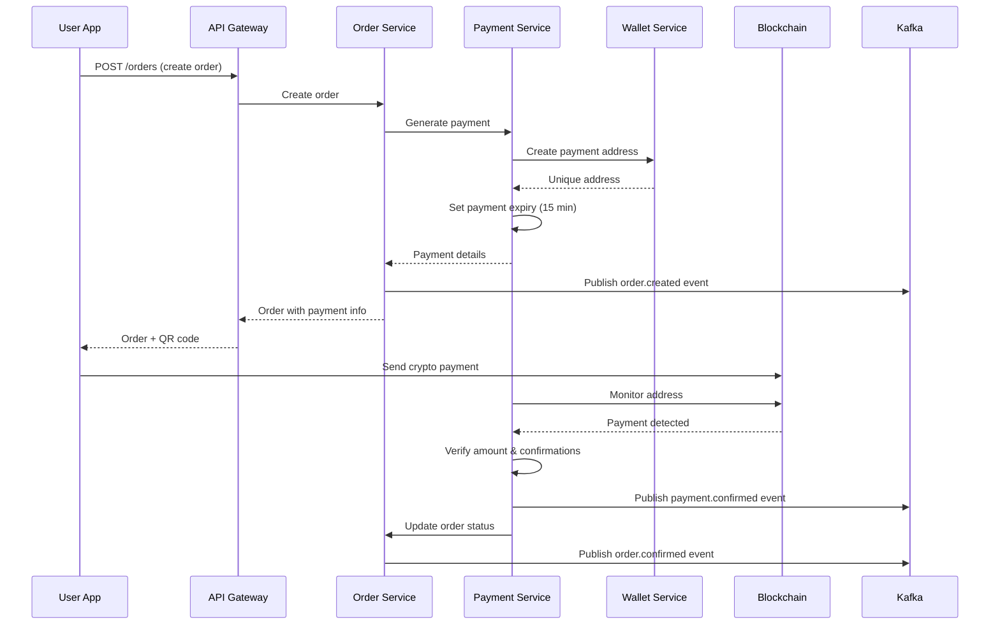
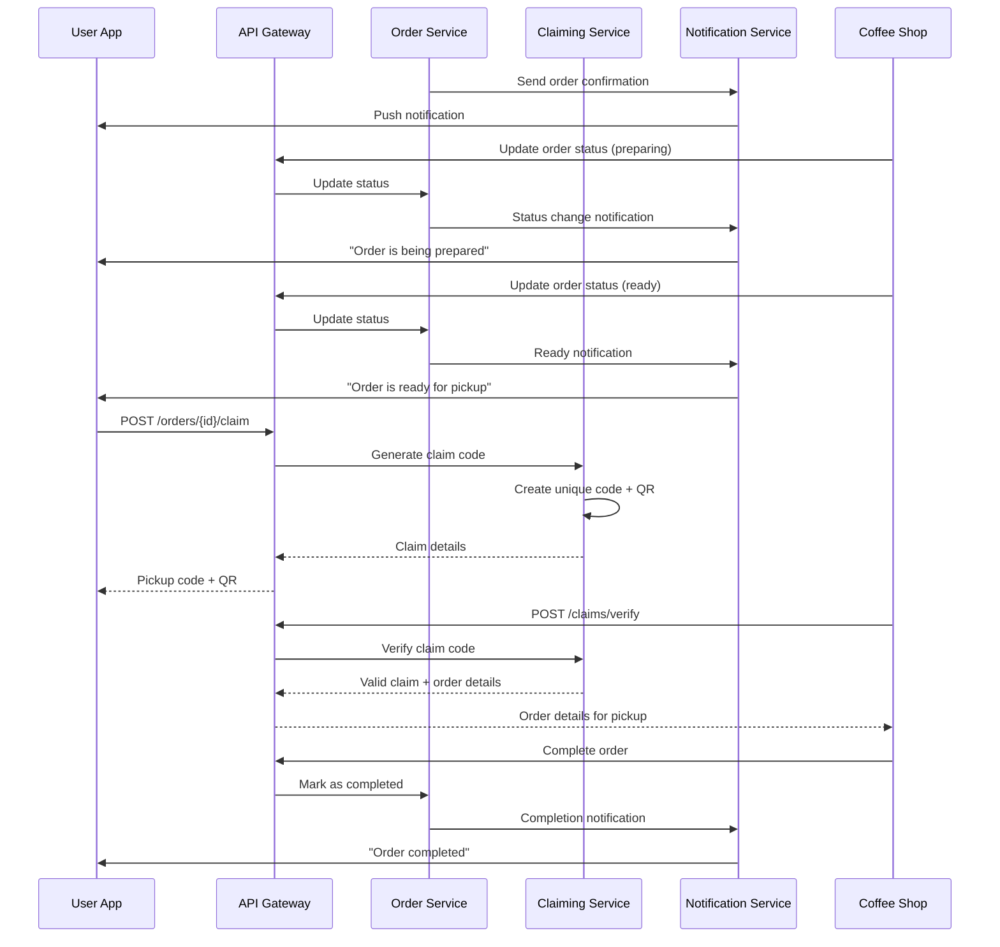

# Coffee Purchase with Cryptocurrency - Complete Flow

## Overview

This document describes the complete end-to-end flow for purchasing coffee using cryptocurrency payments in the Web3 wallet backend system.

## User Journey Flow

### 1. Coffee Shop Discovery

```text
┌─────────────────────────────────────────────────────────────────┐
│                    Coffee Shop Discovery                       │
├─────────────────────────────────────────────────────────────────┤
│ User opens app → Location permission → Find nearby shops       │
│ ↓                                                               │
│ Filter by: Distance, Rating, Crypto support, Open hours        │
│ ↓                                                               │
│ Display list with: Name, Distance, Rating, Crypto currencies   │
└─────────────────────────────────────────────────────────────────┘
```

**API Calls:**
1. `GET /api/v1/coffee-shops?lat={lat}&lng={lng}&radius=5000`
2. `GET /api/v1/coffee-shops/{shop_id}` (for details)

### 2. Menu Browsing and Selection

```text
┌─────────────────────────────────────────────────────────────────┐
│                      Menu Browsing                             │
├─────────────────────────────────────────────────────────────────┤
│ Select shop → Load menu → Browse categories                     │
│ ↓                                                               │
│ View products with: Name, Description, Price (USD + Crypto)    │
│ ↓                                                               │
│ Select product → Choose customizations → Add to cart           │
│ ↓                                                               │
│ Review cart → Select pickup/delivery → Choose crypto currency  │
└─────────────────────────────────────────────────────────────────┘
```

**API Calls:**
1. `GET /api/v1/coffee-shops/{shop_id}/menu`
2. `GET /api/v1/crypto/prices?currencies=BTC,ETH,USDC,USDT`

### 3. Order Creation and Payment

```text
┌─────────────────────────────────────────────────────────────────┐
│                    Order Creation & Payment                    │
├─────────────────────────────────────────────────────────────────┤
│ Create order → Generate payment address → Display QR code      │
│ ↓                                                               │
│ User scans QR or copies address → Sends crypto payment         │
│ ↓                                                               │
│ System monitors blockchain → Detects payment → Verifies amount │
│ ↓                                                               │
│ Payment confirmed → Order status: confirmed → Notify shop      │
└─────────────────────────────────────────────────────────────────┘
```

**API Calls:**
1. `POST /api/v1/orders` (create order)
2. `GET /api/v1/payments/{payment_id}` (check payment status)
3. `POST /api/v1/payments/{payment_id}/verify` (verify transaction)

### 4. Order Preparation and Pickup

```text
┌─────────────────────────────────────────────────────────────────┐
│                  Order Preparation & Pickup                    │
├─────────────────────────────────────────────────────────────────┤
│ Shop receives order → Starts preparation → Updates status      │
│ ↓                                                               │
│ User receives notifications: Confirmed → Preparing → Ready     │
│ ↓                                                               │
│ User arrives at shop → Claims order → Shows pickup code        │
│ ↓                                                               │
│ Shop verifies code → Hands over coffee → Order completed       │
└─────────────────────────────────────────────────────────────────┘
```

**API Calls:**
1. `POST /api/v1/orders/{order_id}/claim` (generate pickup code)
2. `POST /api/v1/claims/verify` (shop verifies pickup code)
3. WebSocket for real-time order status updates

## Detailed Technical Flow

### Phase 1: Shop Discovery and Menu Loading



### Phase 2: Order Creation and Payment Processing



### Phase 3: Order Fulfillment and Claiming



## Error Handling Flows

### Payment Timeout Flow

```text
┌─────────────────────────────────────────────────────────────────┐
│                      Payment Timeout                           │
├─────────────────────────────────────────────────────────────────┤
│ Order created → 15-minute timer starts                         │
│ ↓                                                               │
│ No payment received → Timer expires                            │
│ ↓                                                               │
│ Order status: expired → Release inventory → Notify user        │
│ ↓                                                               │
│ User can create new order if still interested                  │
└─────────────────────────────────────────────────────────────────┘
```

### Insufficient Payment Flow

```text
┌─────────────────────────────────────────────────────────────────┐
│                    Insufficient Payment                        │
├─────────────────────────────────────────────────────────────────┤
│ Payment detected → Amount verification → Insufficient amount    │
│ ↓                                                               │
│ Order status: partial_payment → Notify user                    │
│ ↓                                                               │
│ User options: Send remaining amount OR Request refund          │
│ ↓                                                               │
│ Complete payment → Order confirmed OR Refund processed         │
└─────────────────────────────────────────────────────────────────┘
```

### Shop Unavailable Flow

```text
┌─────────────────────────────────────────────────────────────────┐
│                     Shop Unavailable                           │
├─────────────────────────────────────────────────────────────────┤
│ Order confirmed → Shop suddenly closes/unavailable             │
│ ↓                                                               │
│ System detects unavailability → Auto-refund initiated          │
│ ↓                                                               │
│ Refund processed → User notified → Suggest alternative shops   │
└─────────────────────────────────────────────────────────────────┘
```

## Real-time Updates

### WebSocket Event Types

```javascript
// Order status updates
{
  "type": "order_status_update",
  "order_id": "uuid",
  "status": "preparing",
  "estimated_ready_time": "2024-01-01T15:35:00Z",
  "message": "Your order is being prepared"
}

// Payment confirmations
{
  "type": "payment_confirmed",
  "order_id": "uuid",
  "payment_id": "uuid",
  "confirmations": 12,
  "status": "confirmed"
}

// Price updates
{
  "type": "price_update",
  "currency": "ETH",
  "price_usd": 2500.00,
  "change_24h": 2.5
}
```

## Performance Optimizations

### Caching Strategy

1. **Shop Data**: 4-hour TTL (rarely changes)
2. **Menu Items**: 2-hour TTL (prices may change)
3. **Crypto Prices**: 1-minute TTL (frequent updates)
4. **Order Status**: 30-minute TTL (active orders)
5. **User Preferences**: 1-hour TTL

### Database Optimizations

1. **Indexes**: Location-based queries, order status, payment status
2. **Partitioning**: Orders by date, payments by status
3. **Read Replicas**: Menu browsing, order history
4. **Connection Pooling**: Efficient resource utilization

### Blockchain Monitoring

1. **Webhook Integration**: Real-time payment detection
2. **Batch Processing**: Confirmation updates
3. **Retry Logic**: Failed blockchain calls
4. **Circuit Breakers**: Blockchain service failures

## Security Considerations

### Payment Security

1. **Unique Addresses**: One-time use payment addresses
2. **Amount Verification**: Exact amount matching
3. **Confirmation Requirements**: Network-specific confirmations
4. **Timeout Protection**: 15-minute payment windows

### Order Security

1. **Claim Codes**: Unique, time-limited pickup codes
2. **Shop Verification**: Location-based validation
3. **User Authentication**: JWT-based access control
4. **Rate Limiting**: Prevent abuse and spam

### Data Protection

1. **PII Encryption**: Customer data protection
2. **Payment Isolation**: Separate payment processing
3. **Audit Logging**: Complete transaction trails
4. **GDPR Compliance**: Data privacy regulations

## Monitoring and Analytics

### Key Metrics

1. **Order Metrics**: Creation rate, completion rate, average value
2. **Payment Metrics**: Success rate, confirmation time, failure reasons
3. **Performance Metrics**: Response times, cache hit rates, error rates
4. **Business Metrics**: Revenue, popular items, peak hours

### Alerting

1. **Payment Failures**: High failure rates
2. **Order Issues**: Stuck orders, timeouts
3. **System Health**: Service availability, response times
4. **Business Alerts**: Revenue drops, unusual patterns

This comprehensive flow ensures a smooth, secure, and efficient coffee purchasing experience using cryptocurrency payments while maintaining high performance and reliability across the multi-region deployment.
