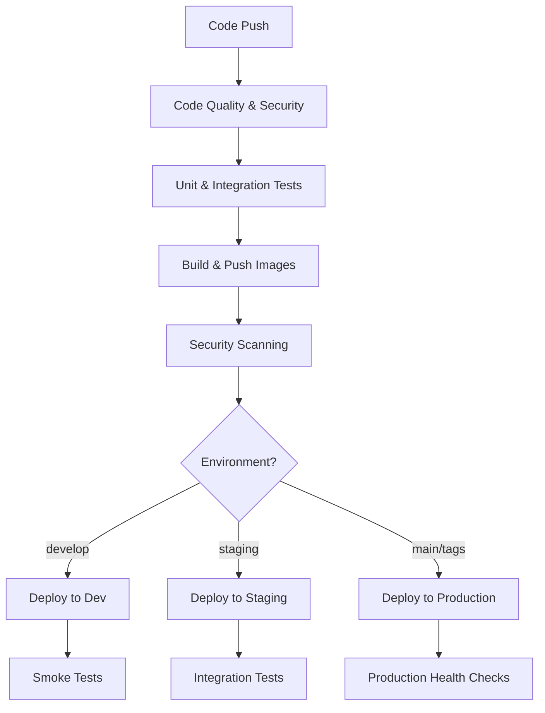
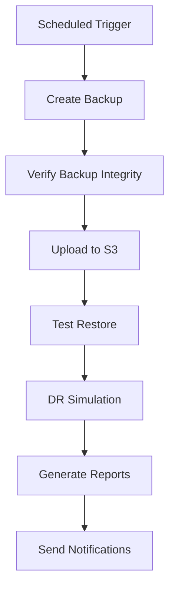

# Go Coffee Platform - CI/CD Guide

This guide provides comprehensive information about the CI/CD pipelines, automated deployments, and continuous integration practices for the Go Coffee platform.

## 📋 Table of Contents

- [Overview](#overview)
- [Pipeline Architecture](#pipeline-architecture)
- [Workflow Descriptions](#workflow-descriptions)
- [Environment Strategy](#environment-strategy)
- [Security and Quality Gates](#security-and-quality-gates)
- [Deployment Strategies](#deployment-strategies)
- [Monitoring and Alerting](#monitoring-and-alerting)
- [Troubleshooting](#troubleshooting)

## 🎯 Overview

The Go Coffee platform uses GitHub Actions for CI/CD with the following key features:

- **Automated testing** with unit, integration, and performance tests
- **Security scanning** with static analysis and vulnerability detection
- **Multi-environment deployments** (development, staging, production)
- **Blue-green deployments** for zero-downtime releases
- **Automated backup and disaster recovery** testing
- **Performance monitoring** and regression detection

### Pipeline Triggers

| Trigger | Workflows | Purpose |
|---------|-----------|---------|
| Push to `main` | CI/CD, Security Scan | Production deployment |
| Push to `develop` | CI/CD | Development deployment |
| Push to `staging` | CI/CD, Performance Testing | Staging deployment |
| Pull Request | CI/CD (test only) | Code validation |
| Schedule (daily) | Backup, Performance Testing | Maintenance |
| Schedule (weekly) | DR Testing | Disaster recovery validation |

## 🏗️ Pipeline Architecture

### Main CI/CD Pipeline (`.github/workflows/ci-cd.yml`)



### Backup & DR Pipeline (`.github/workflows/backup-and-dr.yml`)



## 📝 Workflow Descriptions

### 1. Main CI/CD Workflow

#### Code Quality and Security Checks
- **Go vet** - Static analysis for Go code
- **staticcheck** - Advanced static analysis
- **gosec** - Security vulnerability scanning
- **golangci-lint** - Comprehensive linting

#### Testing Pipeline
- **Unit Tests** - Individual component testing
- **Integration Tests** - Service interaction testing
- **Coverage Analysis** - Code coverage reporting
- **Performance Tests** - Load and stress testing

#### Build and Deployment
- **Multi-architecture builds** - AMD64 and ARM64 support
- **Container scanning** - Trivy vulnerability scanning
- **Image signing** - Cosign for supply chain security
- **Helm chart deployment** - Kubernetes deployment automation

### 2. Backup and Disaster Recovery

#### Automated Backup
```yaml
schedule:
  - cron: '0 2 * * *'  # Daily at 2 AM UTC
```

- **Database backups** - PostgreSQL full dumps
- **Redis backups** - RDB and AOF files
- **Configuration backups** - Kubernetes manifests
- **S3 upload** - Multi-region storage

#### Disaster Recovery Testing
```yaml
schedule:
  - cron: '0 4 * * 0'  # Weekly on Sundays
```

- **Restore testing** - Automated restore validation
- **RTO/RPO measurement** - Recovery time/point objectives
- **Failover testing** - Cross-region failover simulation

### 3. Performance Testing

#### Load Testing
- **K6 performance tests** - Realistic load simulation
- **Threshold validation** - Performance regression detection
- **Grafana integration** - Real-time metrics visualization

#### Stress Testing
- **Breaking point analysis** - System limits identification
- **Resource monitoring** - CPU, memory, network usage
- **Scalability assessment** - Auto-scaling validation

## 🌍 Environment Strategy

### Environment Promotion Flow

```
Feature Branch → Development → Staging → Production
     ↓              ↓           ↓          ↓
   PR Tests    Smoke Tests  Integration  Health Checks
                              Tests     & Monitoring
```

### Environment Configurations

| Environment | Branch | Deployment | Testing | Monitoring |
|-------------|--------|------------|---------|------------|
| Development | `develop` | Automatic | Smoke tests | Basic |
| Staging | `staging` | Automatic | Full integration | Comprehensive |
| Production | `main`/tags | Manual approval | Health checks | Full observability |

### Secrets Management

```yaml
# Environment-specific secrets
secrets:
  KUBE_CONFIG_DEV: ${{ secrets.KUBE_CONFIG_DEV }}
  KUBE_CONFIG_STAGING: ${{ secrets.KUBE_CONFIG_STAGING }}
  KUBE_CONFIG_PROD: ${{ secrets.KUBE_CONFIG_PROD }}
  AWS_ACCESS_KEY_ID: ${{ secrets.AWS_ACCESS_KEY_ID }}
  SLACK_WEBHOOK_URL: ${{ secrets.SLACK_WEBHOOK_URL }}
```

## 🔒 Security and Quality Gates

### Security Scanning Pipeline

1. **Static Analysis**
   - gosec for Go security issues
   - SARIF upload to GitHub Security tab
   - Dependency vulnerability scanning

2. **Container Security**
   - Trivy image scanning
   - Base image vulnerability assessment
   - Supply chain security validation

3. **Runtime Security**
   - Network policy enforcement
   - RBAC validation
   - Secret rotation monitoring

### Quality Gates

#### Code Quality Thresholds
- **Test Coverage**: > 80%
- **Linting**: Zero critical issues
- **Security**: Zero high/critical vulnerabilities
- **Performance**: < 500ms response time (95th percentile)

#### Deployment Gates
- **All tests pass**: Unit, integration, security
- **Performance thresholds met**: Load testing validation
- **Security scan clean**: No critical vulnerabilities
- **Manual approval**: Production deployments

## 🚀 Deployment Strategies

### Blue-Green Deployment

```bash
# Production deployment with blue-green strategy
./scripts/deploy.sh -e production k8s --strategy=blue-green
```

#### Process
1. **Deploy to green environment** - New version deployment
2. **Health check validation** - Comprehensive testing
3. **Traffic switching** - Gradual traffic migration
4. **Blue environment cleanup** - Old version removal

### Rolling Updates

```bash
# Rolling update for non-critical services
kubectl set image deployment/service-name container=new-image:tag
kubectl rollout status deployment/service-name
```

### Canary Deployments

```yaml
# Canary deployment configuration
spec:
  replicas: 10
  strategy:
    canary:
      steps:
      - setWeight: 10    # 10% traffic to new version
      - pause: {duration: 300s}
      - setWeight: 50    # 50% traffic
      - pause: {duration: 600s}
      - setWeight: 100   # Full rollout
```

## 📊 Monitoring and Alerting

### Pipeline Monitoring

#### Success/Failure Tracking
- **Deployment success rate** - Per environment metrics
- **Test failure analysis** - Trend identification
- **Performance regression** - Automated detection

#### Notification Channels
- **Slack integration** - Real-time notifications
- **Email alerts** - Critical failure notifications
- **PagerDuty** - Production incident escalation

### Metrics Collection

```yaml
# Key CI/CD metrics
metrics:
  - deployment_frequency
  - lead_time_for_changes
  - mean_time_to_recovery
  - change_failure_rate
```

### Dashboard Integration

- **GitHub Actions dashboard** - Pipeline status overview
- **Grafana dashboards** - Performance metrics
- **Prometheus alerts** - Infrastructure monitoring

## 🔧 Troubleshooting

### Common Issues

#### Build Failures
```bash
# Debug build issues
docker build --no-cache -t debug-image .
docker run -it debug-image /bin/sh
```

#### Test Failures
```bash
# Run tests locally with same environment
export TEST_DB_HOST=localhost
export TEST_REDIS_HOST=localhost
go test -v ./...
```

#### Deployment Issues
```bash
# Check deployment status
kubectl rollout status deployment/service-name -n namespace
kubectl describe deployment service-name -n namespace
kubectl logs -f deployment/service-name -n namespace
```

### Pipeline Debugging

#### GitHub Actions Debugging
```yaml
# Enable debug logging
- name: Debug step
  run: |
    echo "::debug::Debug message"
    echo "GITHUB_WORKSPACE: $GITHUB_WORKSPACE"
    echo "GITHUB_SHA: $GITHUB_SHA"
```

#### Kubernetes Debugging
```bash
# Check pod status
kubectl get pods -n namespace
kubectl describe pod pod-name -n namespace
kubectl logs pod-name -n namespace --previous
```

### Recovery Procedures

#### Failed Deployment Recovery
1. **Immediate rollback**
   ```bash
   kubectl rollout undo deployment/service-name -n namespace
   ```

2. **Health check validation**
   ```bash
   ./scripts/health-check.sh --environment=production
   ```

3. **Incident response**
   - Notify stakeholders
   - Create incident ticket
   - Begin root cause analysis

## 📚 Best Practices

### Development Workflow
1. **Feature branches** - Isolated development
2. **Pull request reviews** - Code quality assurance
3. **Automated testing** - Continuous validation
4. **Security scanning** - Early vulnerability detection

### Deployment Practices
1. **Infrastructure as Code** - Version-controlled infrastructure
2. **Immutable deployments** - Container-based deployments
3. **Health checks** - Comprehensive validation
4. **Rollback procedures** - Quick recovery mechanisms

### Monitoring Practices
1. **Comprehensive logging** - Structured log aggregation
2. **Metrics collection** - Performance and business metrics
3. **Alerting strategy** - Actionable alerts only
4. **Dashboard design** - Clear visualization

## 🔗 Additional Resources

- [Deployment Guide](./DEPLOYMENT_GUIDE.md)
- [Disaster Recovery Plan](./DISASTER_RECOVERY_PLAN.md)
- [Monitoring Guide](./MONITORING_GUIDE.md)
- [Security Guide](./SECURITY_GUIDE.md)
- [Performance Testing Guide](./PERFORMANCE_TESTING_GUIDE.md)

## 📞 Support

For CI/CD pipeline issues:

1. Check the [troubleshooting section](#troubleshooting)
2. Review GitHub Actions logs
3. Check deployment status in Kubernetes
4. Consult monitoring dashboards
5. Create an issue with detailed error information

**Emergency Contacts:**
- DevOps Team: devops@go-coffee.com
- On-call Engineer: +1-xxx-xxx-xxxx
- Slack: #devops-support
