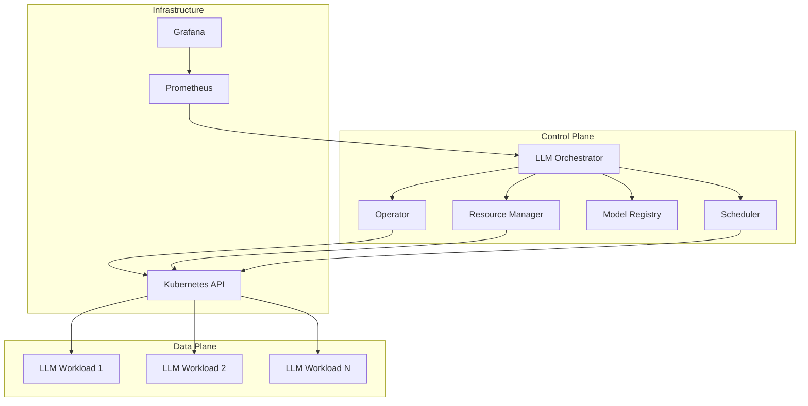

# 🚀 LLM Orchestrator: Cutting-Edge Control Systems for Containerized LLM Workloads

## Overview

The LLM Orchestrator is a sophisticated, production-ready system designed to manage and optimize Large Language Model (LLM) workloads in high-performance containerized environments. Built on Kubernetes, it provides intelligent scheduling, resource management, and performance optimization for AI/ML workloads at scale.

## 🌟 Key Features

### 🧠 Intelligent LLM Scheduler
- **Performance-Aware Scheduling**: Optimizes placement based on model requirements and node capabilities
- **GPU Resource Management**: Intelligent GPU allocation and fragmentation prevention
- **Model Affinity**: Prefers nodes with cached models for faster startup times
- **QoS-Based Prioritization**: Different service levels (Premium, Standard, Basic)
- **Predictive Scaling**: ML-based demand forecasting for proactive resource provisioning

### 📊 Advanced Resource Management
- **Real-Time Monitoring**: Continuous tracking of CPU, memory, GPU, and network utilization
- **Auto-Scaling**: Horizontal and vertical scaling based on performance metrics
- **Resource Optimization**: Intelligent workload migration and load balancing
- **Multi-Tenant Support**: Isolated resource allocation per tenant/namespace

### 🗄️ Model Registry & Versioning
- **Centralized Model Management**: Store, version, and distribute LLM models
- **A/B Testing Framework**: Deploy multiple model versions simultaneously
- **Performance Benchmarking**: Automated model performance evaluation
- **Security & Compliance**: Checksum validation and access control

### 🔧 Kubernetes Operator
- **Custom Resource Definitions**: Native Kubernetes integration with LLMWorkload CRDs
- **Declarative Management**: GitOps-friendly configuration management
- **Health Monitoring**: Comprehensive health checks and self-healing capabilities
- **Event-Driven Architecture**: Reactive system responding to cluster changes

## 🏗️ Architecture



## 🚀 Quick Start

### Prerequisites
- Kubernetes cluster (v1.25+)
- kubectl configured
- Helm 3.x (optional)

### Installation

1. **Deploy CRDs and RBAC**:
```bash
kubectl apply -f k8s/llm-orchestrator/namespace.yaml
kubectl apply -f k8s/llm-orchestrator/crd.yaml
kubectl apply -f k8s/llm-orchestrator/rbac.yaml
```

2. **Deploy the Orchestrator**:
```bash
kubectl apply -f k8s/llm-orchestrator/deployment.yaml
```

3. **Verify Installation**:
```bash
kubectl get pods -n llm-orchestrator
kubectl logs -n llm-orchestrator deployment/llm-orchestrator
```

### Creating Your First LLM Workload

```yaml
apiVersion: llm.orchestrator.io/v1
kind: LLMWorkload
metadata:
  name: my-llm-workload
  namespace: llm-workloads
spec:
  modelName: "llama2"
  modelVersion: "7b"
  modelType: "text-generation"
  
  resources:
    cpu: "2000m"
    memory: "8Gi"
    gpu: "1"
    
  scaling:
    minReplicas: 1
    maxReplicas: 5
    targetMetrics:
    - type: "cpu"
      target: 70
    - type: "requests_per_second"
      target: 100
      
  performance:
    maxLatency: "500ms"
    minThroughput: 50
    slaRequirements:
      availability: 99.9
      responseTimeP95: 200
      errorRate: 0.01
```

Apply the workload:
```bash
kubectl apply -f my-llm-workload.yaml
```

## 📋 Configuration

### Orchestrator Configuration

The orchestrator is configured via YAML files. Key configuration sections:

#### Scheduler Configuration
```yaml
scheduler:
  strategy: "performance-aware"
  resourceOvercommitRatio: 1.2
  localityPreference: true
  predictiveScaling: true
  
  qosClasses:
    premium:
      priority: 100
      resourceGuarantee: 0.9
      maxLatency: 50
    standard:
      priority: 50
      resourceGuarantee: 0.7
      maxLatency: 200
```

#### Resource Manager Configuration
```yaml
resourceManager:
  optimizationInterval: "5m"
  resourceUtilizationTarget: 0.8
  scaleUpThreshold: 0.8
  scaleDownThreshold: 0.3
  maxCPUPerWorkload: "8000m"
  maxMemoryPerWorkload: "32Gi"
```

#### Model Registry Configuration
```yaml
modelRegistry:
  storageType: "local"  # or s3, gcs, azure
  storagePath: "/var/lib/llm-models"
  cacheSize: 107374182400  # 100GB
  benchmarkOnRegister: true
  checksumValidation: true
```

## 🔍 Monitoring & Observability

### Metrics

The orchestrator exposes comprehensive metrics via Prometheus:

- **Workload Metrics**: Request rate, latency, error rate, throughput
- **Resource Metrics**: CPU, memory, GPU utilization across nodes
- **Scheduling Metrics**: Scheduling latency, success rate, queue length
- **Model Metrics**: Model performance, cache hit rate, usage statistics

### Dashboards

Pre-built Grafana dashboards provide visualization for:
- Cluster resource utilization
- Workload performance trends
- Model usage analytics
- System health overview

### Alerting

Built-in alerting rules for:
- High resource utilization
- Scheduling failures
- Performance degradation
- Model availability issues

## 🔧 Advanced Features

### Multi-Model Deployments
Deploy multiple model versions with traffic splitting:

```yaml
spec:
  deploymentStrategy:
    type: "canary"
    canary:
      trafficSplit: 10  # 10% to new version
      duration: "10m"
      successThreshold: 0.99
```

### Custom Resource Profiles
Define reusable resource profiles:

```yaml
resourceProfiles:
  large-gpu:
    cpu: "4000m"
    memory: "16Gi"
    gpu: 2
    maxReplicas: 10
```

### Cross-Cluster Scheduling
Schedule workloads across multiple Kubernetes clusters:

```yaml
spec:
  placement:
    clusters: ["cluster-1", "cluster-2"]
    strategy: "cost-optimized"
```

## 🛡️ Security

### Pod Security
- Non-root containers
- Read-only root filesystem
- Dropped capabilities
- Security contexts

### Network Security
- Network policies for traffic isolation
- TLS encryption for inter-component communication
- RBAC for fine-grained access control

### Model Security
- Checksum validation for model integrity
- Digital signatures for model authenticity
- Access control for model registry

## 🔄 CI/CD Integration

### GitOps Workflow
```yaml
# .github/workflows/deploy-llm-workload.yml
name: Deploy LLM Workload
on:
  push:
    paths: ['workloads/**']
    
jobs:
  deploy:
    runs-on: ubuntu-latest
    steps:
    - uses: actions/checkout@v3
    - name: Deploy to Kubernetes
      run: |
        kubectl apply -f workloads/
```

### Automated Testing
```bash
# Test workload deployment
kubectl apply -f test-workload.yaml
kubectl wait --for=condition=Ready llmworkload/test-workload --timeout=300s
kubectl delete -f test-workload.yaml
```

## 📈 Performance Tuning

### Optimization Guidelines

1. **Resource Allocation**:
   - Use resource requests/limits appropriately
   - Consider GPU memory requirements
   - Monitor resource utilization trends

2. **Model Optimization**:
   - Use quantized models for better performance
   - Enable model caching for faster startup
   - Implement model warming strategies

3. **Scaling Configuration**:
   - Set appropriate scaling thresholds
   - Use predictive scaling for traffic patterns
   - Configure proper cooldown periods

## 🐛 Troubleshooting

### Common Issues

1. **Workload Stuck in Pending**:
```bash
kubectl describe llmworkload <workload-name>
kubectl get events --sort-by=.metadata.creationTimestamp
```

2. **Resource Allocation Failures**:
```bash
kubectl top nodes
kubectl describe nodes
```

3. **Model Loading Issues**:
```bash
kubectl logs -n llm-orchestrator deployment/llm-orchestrator
kubectl get llmmodels
```

### Debug Commands
```bash
# Check orchestrator status
kubectl get pods -n llm-orchestrator
kubectl logs -n llm-orchestrator deployment/llm-orchestrator

# Check workload status
kubectl get llmworkloads -A
kubectl describe llmworkload <name> -n <namespace>

# Check resource usage
kubectl top nodes
kubectl top pods -A
```

## 🤝 Contributing

We welcome contributions! Please see our [Contributing Guide](../CONTRIBUTING.md) for details.

### Development Setup
```bash
git clone https://github.com/DimaJoyti/go-coffee.git
cd go-coffee
make build-llm-orchestrator
make test-llm-orchestrator
```

## 📄 License

This project is licensed under the MIT License - see the [LICENSE](../LICENSE) file for details.

## 🆘 Support

- 📖 [Documentation](https://github.com/DimaJoyti/go-coffee/docs)
- 🐛 [Issue Tracker](https://github.com/DimaJoyti/go-coffee/issues)
- 💬 [Discussions](https://github.com/DimaJoyti/go-coffee/discussions)
- 📧 [Email Support](mailto:support@go-coffee.io)

---

**Built with ❤️ by the Go Coffee Team**
