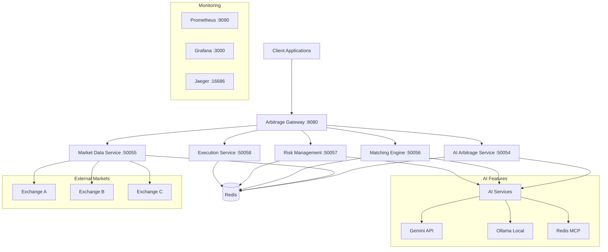

# 🤖 AI Arbitrage System - Connecting Buyers and Sellers

An intelligent arbitrage system that uses AI to connect buyers and sellers through automated opportunity detection, smart matching, and risk-assessed trade execution.

## 🌟 System Overview

The AI Arbitrage System is a comprehensive microservices ecosystem that combines:

- **🧠 AI Arbitrage Service** - Intelligent opportunity detection and management
- **📊 Market Data Service** - Real-time market data aggregation
- **🤝 Matching Engine Service** - AI-powered buyer-seller matching
- **⚖️ Risk Management Service** - Intelligent risk assessment
- **⚡ Execution Service** - Automated trade execution and settlement

## 🏗️ Architecture



## 🚀 Quick Start

### Prerequisites

- Go 1.22+
- Docker & Docker Compose
- Protocol Buffers compiler
- Redis
- Git

### Installation

1. **Clone the repository:**
   ```bash
   git clone https://github.com/DimaJoyti/go-coffee.git
   cd go-coffee
   ```

2. **Quick setup:**
   ```bash
   make -f Makefile.ai-arbitrage quick-start
   ```

3. **Start all services:**
   ```bash
   make -f Makefile.ai-arbitrage run-all
   ```

4. **Run the demo:**
   ```bash
   make -f Makefile.ai-arbitrage demo
   ```

## 🔧 Manual Setup

### 1. Install Dependencies
```bash
make -f Makefile.ai-arbitrage install-deps
```

### 2. Generate Protocol Buffers
```bash
make -f Makefile.ai-arbitrage proto
```

### 3. Build Services
```bash
make -f Makefile.ai-arbitrage build
```

### 4. Start Infrastructure
```bash
make -f Makefile.ai-arbitrage run-infrastructure
```

### 5. Run Services
```bash
# Terminal 1: AI Arbitrage Service
make -f Makefile.ai-arbitrage run-arbitrage

# Terminal 2: Market Data Service
make -f Makefile.ai-arbitrage run-market-data

# Terminal 3: Matching Engine Service
make -f Makefile.ai-arbitrage run-matching
```

## 🌐 Service Endpoints

| Service | Port | Description |
|---------|------|-------------|
| AI Arbitrage Service | 50054 | Main arbitrage engine |
| Market Data Service | 50055 | Real-time market data |
| Matching Engine Service | 50056 | Buyer-seller matching |
| Risk Management Service | 50057 | Risk assessment |
| Execution Service | 50058 | Trade execution |
| API Gateway | 8080 | HTTP REST API |
| Redis | 6379 | Data storage |
| Prometheus | 9090 | Metrics |
| Grafana | 3000 | Dashboards |
| Jaeger | 16686 | Tracing |

## 📡 API Examples

### REST API (via Gateway)

#### Create Arbitrage Opportunity
```bash
curl -X POST http://localhost:8080/api/v1/arbitrage/opportunities \
  -H "Content-Type: application/json" \
  -d '{
    "asset_symbol": "COFFEE",
    "buy_price": 100.0,
    "sell_price": 105.0,
    "volume": 1000.0,
    "buy_market": "Exchange_A",
    "sell_market": "Exchange_B"
  }'
```

#### Get Opportunities
```bash
curl "http://localhost:8080/api/v1/arbitrage/opportunities?asset=COFFEE&min_profit=2.0"
```

#### Get Market Prices
```bash
curl "http://localhost:8080/api/v1/market-data/prices?assets=COFFEE,BTC&markets=Exchange_A,Exchange_B"
```

#### Execute Trade
```bash
curl -X POST http://localhost:8080/api/v1/arbitrage/trades \
  -H "Content-Type: application/json" \
  -d '{
    "opportunity_id": "opp_123",
    "buyer_id": "buyer_001",
    "seller_id": "seller_001",
    "quantity": 100.0,
    "price": 105.0
  }'
```

### gRPC API

#### Test with grpcurl
```bash
# Create opportunity
grpcurl -plaintext -d '{
  "asset_symbol":"COFFEE",
  "buy_price":100.0,
  "sell_price":105.0,
  "volume":1000.0,
  "buy_market":"Exchange_A",
  "sell_market":"Exchange_B"
}' localhost:50054 arbitrage.ArbitrageService/CreateOpportunity

# Get opportunities
grpcurl -plaintext -d '{
  "asset_symbol":"COFFEE",
  "min_profit_margin":2.0
}' localhost:50054 arbitrage.ArbitrageService/GetOpportunities

# Get market prices
grpcurl -plaintext -d '{
  "asset_symbols":["COFFEE","BTC"]
}' localhost:50055 arbitrage.MarketDataService/GetMarketPrices
```

## 🤖 AI Features

### 1. Opportunity Detection
- **Real-time Analysis**: Continuously monitors market data across exchanges
- **Pattern Recognition**: AI identifies profitable arbitrage opportunities
- **Risk Assessment**: Evaluates opportunity risk using ML models
- **Confidence Scoring**: Provides AI confidence levels for each opportunity

### 2. Intelligent Matching
- **Participant Profiling**: Analyzes buyer/seller preferences and risk tolerance
- **Compatibility Scoring**: AI calculates optimal buyer-seller matches
- **Quantity Optimization**: Determines optimal trade quantities
- **Timing Analysis**: Identifies best execution timing

### 3. Risk Management
- **Dynamic Risk Scoring**: Real-time risk assessment using AI
- **Exposure Monitoring**: Tracks participant exposure limits
- **Market Volatility Analysis**: AI-powered volatility prediction
- **Automated Risk Controls**: Intelligent trade rejection/approval

### 4. Market Analysis
- **Price Prediction**: ML models for price forecasting
- **Sentiment Analysis**: Market sentiment from news and social media
- **Volatility Modeling**: Advanced volatility prediction
- **Support/Resistance Levels**: AI-identified key price levels

## 🔄 Workflow

### 1. Market Data Aggregation
```
External Exchanges → Market Data Service → Redis → AI Analysis
```

### 2. Opportunity Detection
```
Market Data → AI Analysis → Opportunity Creation → Participant Notification
```

### 3. Participant Matching
```
Opportunity → Participant Pool → AI Matching → Match Recommendations
```

### 4. Trade Execution
```
Match Selection → Risk Assessment → Trade Execution → Settlement
```

## 🐳 Docker Deployment

### Using Docker Compose
```bash
# Start all services
docker-compose -f docker-compose.ai-arbitrage.yml up -d

# View logs
docker-compose -f docker-compose.ai-arbitrage.yml logs -f

# Stop services
docker-compose -f docker-compose.ai-arbitrage.yml down
```

### Individual Service Deployment
```bash
# Build images
make -f Makefile.ai-arbitrage docker-build

# Run specific service
docker run -d --name ai-arbitrage-service \
  -p 50054:50054 \
  -e REDIS_URL=redis://localhost:6379 \
  ai-arbitrage-service
```

## 📊 Monitoring & Observability

### Metrics (Prometheus)
- Opportunity detection rate
- Trade execution success rate
- Participant matching efficiency
- System latency and throughput
- Error rates and availability

### Dashboards (Grafana)
- Real-time arbitrage opportunities
- Market data visualization
- Trading performance metrics
- System health monitoring

### Tracing (Jaeger)
- Request flow across services
- Performance bottleneck identification
- Error tracking and debugging

## 🧪 Testing

### Unit Tests
```bash
make -f Makefile.ai-arbitrage test
```

### Integration Tests
```bash
make -f Makefile.ai-arbitrage test-integration
```

### Performance Benchmarks
```bash
make -f Makefile.ai-arbitrage benchmark
```

### API Testing
```bash
make -f Makefile.ai-arbitrage test-api
```

## 🔧 Configuration

### Environment Variables
```bash
# AI Arbitrage Service
GRPC_PORT=50054
REDIS_URL=redis://localhost:6379
GEMINI_API_KEY=your-gemini-key
OLLAMA_BASE_URL=http://localhost:11434

# Market Data Service
GRPC_PORT=50055
MARKET_DATA_REFRESH_INTERVAL=5s
PRICE_VOLATILITY_THRESHOLD=0.05

# Matching Engine
GRPC_PORT=50056
MATCHING_ALGORITHM=ai_optimized
MIN_MATCH_SCORE=0.5

# Risk Management
GRPC_PORT=50057
MAX_RISK_SCORE=0.8
DAILY_EXPOSURE_LIMIT=100000

# Execution Service
GRPC_PORT=50058
EXECUTION_TIMEOUT=30s
SETTLEMENT_DELAY=1s
```

## 🚨 Troubleshooting

### Common Issues

1. **Service Connection Failed**
   ```bash
   # Check service status
   make -f Makefile.ai-arbitrage status
   
   # Check health
   make -f Makefile.ai-arbitrage health
   ```

2. **Redis Connection Error**
   ```bash
   # Restart Redis
   make -f Makefile.ai-arbitrage run-redis
   ```

3. **Proto Generation Failed**
   ```bash
   # Reinstall protoc dependencies
   make -f Makefile.ai-arbitrage install-deps
   make -f Makefile.ai-arbitrage proto
   ```

### Logs
```bash
# View all logs
make -f Makefile.ai-arbitrage logs

# View specific service logs
tail -f logs/ai-arbitrage-service.log
```

## 🤝 Contributing

1. Fork the repository
2. Create a feature branch
3. Make your changes
4. Add tests
5. Submit a pull request

## 📄 License

This project is licensed under the MIT License - see the LICENSE file for details.

## 🆘 Support

- 📧 Email: support@go-coffee.com
- 💬 Discord: [Go Coffee Community](https://discord.gg/go-coffee)
- 📖 Documentation: [docs/ai-arbitrage/](docs/ai-arbitrage/)
- 🐛 Issues: [GitHub Issues](https://github.com/DimaJoyti/go-coffee/issues)

---

**Built with ❤️ by the Go Coffee Team**
