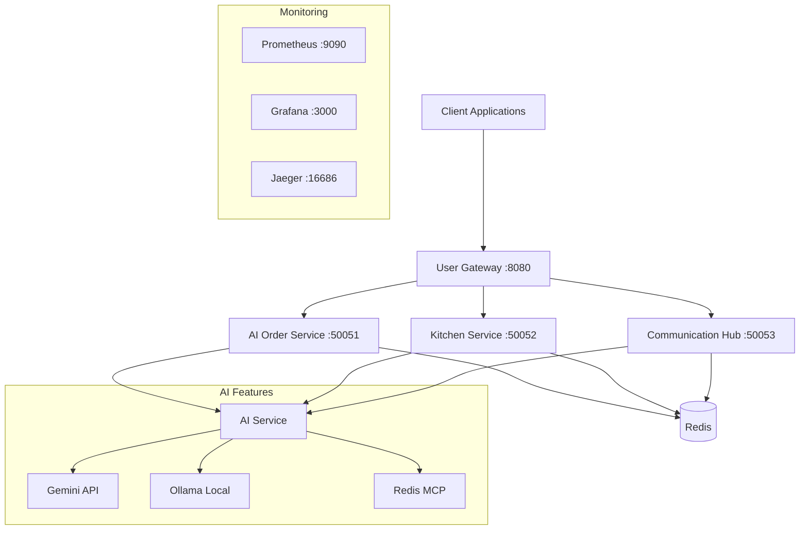

# 🤖 AI Order Management Service

Intelligent order management system using Go gRPC microservices and AI analytics.

## 🌟 System Overview

AI Order Management Service is a comprehensive microservices ecosystem that combines:

- **🧠 AI Order Service** - Intelligent order management with AI analytics
- **👨‍🍳 Kitchen Management Service** - AI-optimized kitchen processes
- **📡 Communication Hub** - Centralized inter-service communication
- **🌐 User Gateway** - HTTP API for client requests

## 🏗️ Architecture



## 🚀 Quick Start

### Prerequisites

- **Go 1.22+** - Latest Go version
- **Docker & Docker Compose** - For containerization
- **Redis 7+** - For AI context and caching
- **Protocol Buffers** - For gRPC

### 🔧 Installation

1. **Clone repository**
   ```bash
   git clone https://github.com/DimaJoyti/go-coffee.git
   cd go-coffee
   ```

2. **Install dependencies**
   ```bash
   make -f Makefile.ai-order install-deps
   make -f Makefile.ai-order install-proto
   ```

3. **Generate protobuf code**
   ```bash
   make -f Makefile.ai-order proto
   ```

4. **Build services**
   ```bash
   make -f Makefile.ai-order build
   ```

### 🐳 Run with Docker

```bash
# Start all services
docker-compose -f docker-compose.ai-order.yml up -d

# Check status
docker-compose -f docker-compose.ai-order.yml ps

# View logs
docker-compose -f docker-compose.ai-order.yml logs -f
```

### 🛠️ Local Development

```bash
# Start Redis
make -f Makefile.ai-order run-redis

# Start all services
make -f Makefile.ai-order run-all

# Or start individual services
make -f Makefile.ai-order run-ai-order
make -f Makefile.ai-order run-kitchen
make -f Makefile.ai-order run-communication
make -f Makefile.ai-order run-gateway
```

## 📡 API Documentation

### REST API Endpoints

#### Order Management
```bash
# Create order
POST /api/v1/orders
{
  "customer": {
    "id": "customer-123",
    "name": "John Doe",
    "email": "john@example.com"
  },
  "items": [
    {
      "product_id": "latte-001",
      "product_name": "Latte",
      "quantity": 1,
      "unit_price": 4.50,
      "total_price": 4.50
    }
  ],
  "location_id": "downtown",
  "enable_ai_optimization": true
}

# Get order
GET /api/v1/orders/{id}

# List orders
GET /api/v1/orders?customer_id=123&status=PENDING

# Update status
PUT /api/v1/orders/{id}/status
{
  "new_status": "CONFIRMED",
  "notify_customer": true
}

# Cancel order
DELETE /api/v1/orders/{id}
```

#### AI Recommendations
```bash
# Get recommendations
GET /api/v1/recommendations/orders?customer_id=123&location_id=downtown

# Analyze patterns
GET /api/v1/recommendations/patterns?location_id=downtown&analysis_type=daily
```

#### Kitchen Management
```bash
# Kitchen queue
GET /api/v1/kitchen/queue?location_id=downtown

# Add to queue
POST /api/v1/kitchen/queue
{
  "order_id": "order-123",
  "customer_name": "John Doe",
  "items": ["Latte", "Croissant"],
  "location_id": "downtown"
}

# Kitchen metrics
GET /api/v1/kitchen/metrics?location_id=downtown

# Optimize workflow
POST /api/v1/kitchen/optimize
```

### gRPC Services

#### AI Order Service (Port 50051)
- `CreateOrder` - Create order with AI analysis
- `GetOrder` - Get order with AI insights
- `ListOrders` - List orders with AI filtering
- `UpdateOrderStatus` - Update status with AI validation
- `CancelOrder` - Cancel with AI impact analysis
- `GetOrderRecommendations` - AI recommendations
- `AnalyzeOrderPatterns` - Pattern analysis
- `PredictCompletionTime` - Time prediction

#### Kitchen Service (Port 50052)
- `AddToQueue` - Add to queue with AI prioritization
- `GetQueue` - Get queue with AI insights
- `UpdatePreparationStatus` - Update preparation status
- `CompleteOrder` - Complete order
- `GetPerformanceMetrics` - Performance metrics
- `OptimizeWorkflow` - AI workflow optimization
- `PredictCapacity` - Capacity prediction

#### Communication Hub (Port 50053)
- `SendMessage` - Send messages
- `SubscribeToMessages` - Subscribe to messages
- `BroadcastMessage` - Broadcast messages
- `GetMessageHistory` - Message history
- `RegisterService` - Service registration
- `SendNotification` - AI-optimized notifications

## 🤖 AI Functionality

### Intelligent Order Analysis
- **Complexity Analysis** - Order complexity assessment
- **Time Prediction** - AI cooking time prediction
- **Recommendations** - Personalized recommendations
- **Price Optimization** - Dynamic pricing

### Smart Kitchen
- **Queue Optimization** - AI cooking queue planning
- **Resource Management** - Smart equipment utilization
- **Ingredient Forecasting** - AI demand prediction
- **Quality Monitoring** - Quality and speed control

### Intelligent Communication
- **Smart Routing** - AI message routing
- **Pattern Analysis** - Communication pattern analysis
- **Automatic Resolution** - AI conflict resolution
- **Problem Prediction** - Preventive issue detection

## 📊 Monitoring and Observability

### Prometheus Metrics
- Orders per minute
- Service response times
- AI model usage
- Kitchen efficiency

### Grafana Dashboards
- System overview
- AI analytics
- Kitchen performance
- Communication metrics

### Jaeger Tracing
- Distributed tracing
- Performance analysis
- Bottleneck identification

## 🧪 Testing

```bash
# Run all tests
make -f Makefile.ai-order test

# Test individual services
make -f Makefile.ai-order test-ai-order
make -f Makefile.ai-order test-kitchen
make -f Makefile.ai-order test-communication

# Tests with coverage
make -f Makefile.ai-order test-coverage

# API tests
make -f Makefile.ai-order test-api
```

## 🔧 Configuration

### Environment Variables

```bash
# AI Order Service
GRPC_PORT=50051
REDIS_URL=redis://localhost:6379
GEMINI_API_KEY=your_gemini_key
OLLAMA_BASE_URL=http://localhost:11434

# Kitchen Service
GRPC_PORT=50052

# Communication Hub
GRPC_PORT=50053

# User Gateway
HTTP_PORT=8080
AI_ORDER_SERVICE_ADDR=localhost:50051
KITCHEN_SERVICE_ADDR=localhost:50052
COMMUNICATION_HUB_ADDR=localhost:50053
```

## 🚀 Deployment

### Local Deployment
```bash
make -f Makefile.ai-order deploy-local
```

### Kubernetes
```bash
make -f Makefile.ai-order deploy-k8s
```

### Docker Swarm
```bash
docker stack deploy -c docker-compose.ai-order.yml ai-order-stack
```

## 📚 Additional Resources

- [API Documentation](http://localhost:8080/api/docs)
- [Prometheus Metrics](http://localhost:9090)
- [Grafana Dashboards](http://localhost:3000)
- [Jaeger Tracing](http://localhost:16686)
- [Redis Insight](http://localhost:8001)

## 🤝 Contributing

1. Fork the repository
2. Create feature branch
3. Make changes
4. Add tests
5. Create Pull Request

## 📄 License

MIT License - see [LICENSE](LICENSE) file for details.

---

**Created with ❤️ for Go Coffee Co.**
