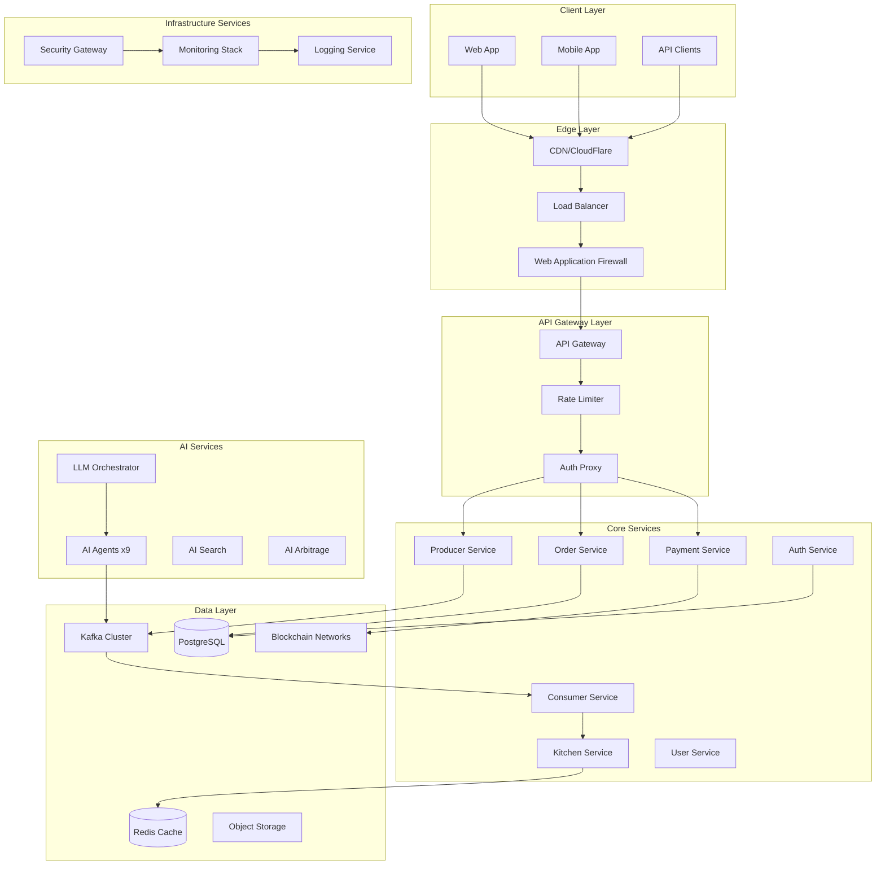
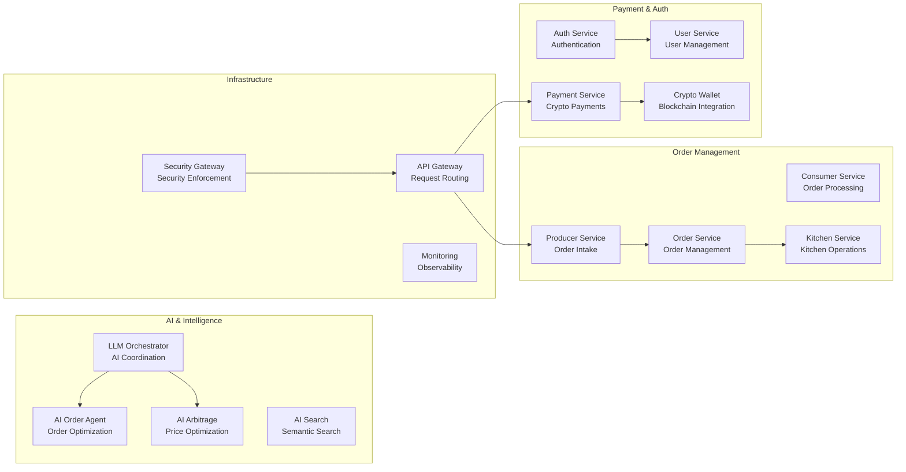
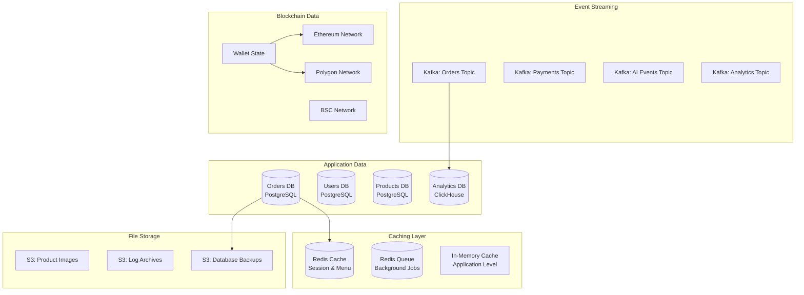
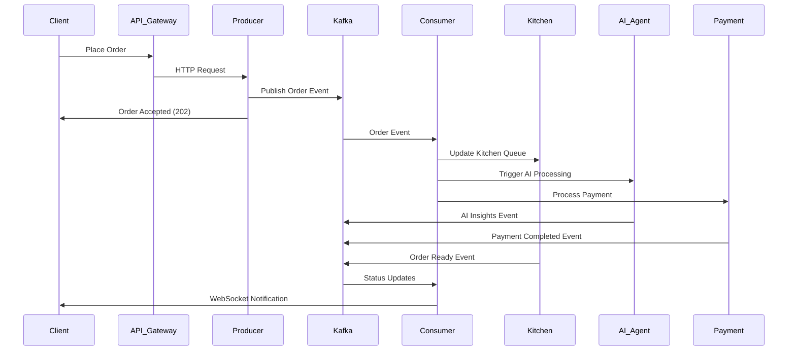
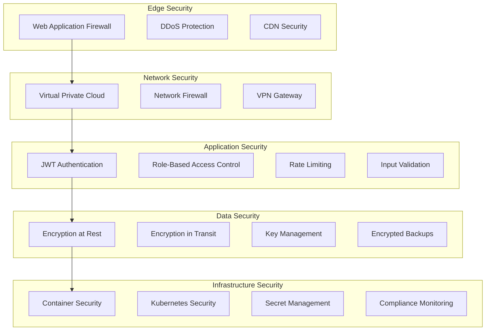
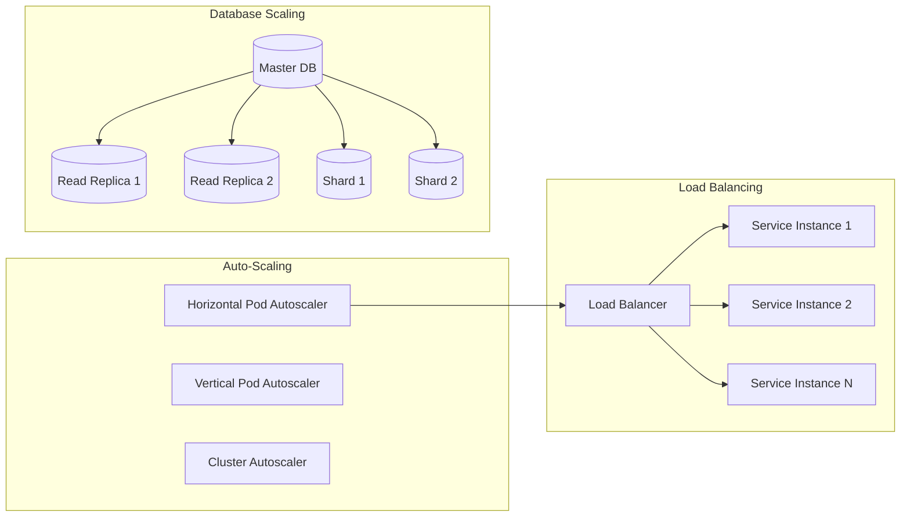
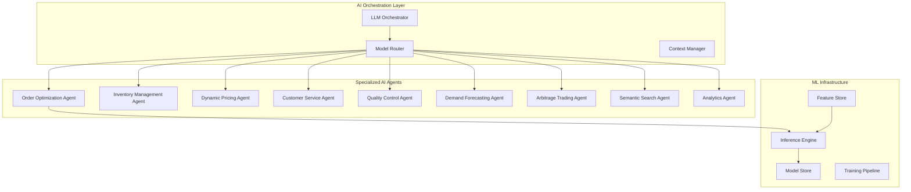
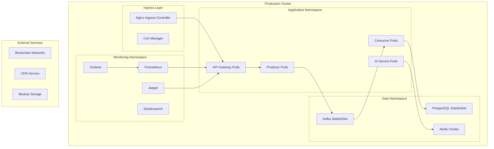

# Go Coffee System Architecture Schema

This document provides comprehensive architecture schemas for the Go Coffee system, designed for system design  preparation. It covers the complete microservices ecosystem, data flow, and infrastructure patterns.

## 🏗️ High-Level System Architecture

The Go Coffee system is a comprehensive microservices platform demonstrating enterprise-scale system design patterns:

## 🎯 System Design  Focus Areas

This architecture demonstrates key system design concepts:

- **Scalability**: Horizontal scaling with load balancers and microservices
- **Reliability**: Circuit breakers, retries, and fault tolerance
- **Performance**: Caching layers, CDN, and optimized data access
- **Security**: Multi-layer security with WAF, auth, and encryption
- **Observability**: Comprehensive monitoring, logging, and tracing

## 🔄 Microservices Architecture Detail

### Core Service Ecosystem

### Service Responsibilities

| Service | Primary Function | Key Features |
|---------|------------------|--------------|
| **Producer** | Order intake and validation | HTTP API, Request validation, Kafka publishing |
| **Consumer** | Order processing and fulfillment | Event processing, Business logic, State management |
| **Order Service** | Order lifecycle management | CRUD operations, Status tracking, History |
| **Kitchen Service** | Kitchen operations | Staff management, Equipment tracking, Workflow |
| **Payment Service** | Payment processing | Multi-chain support, Transaction validation |
| **Auth Service** | Authentication & authorization | JWT tokens, RBAC, Session management |
| **AI Orchestrator** | AI agent coordination | Model management, Request routing, Response aggregation |
| **API Gateway** | Request routing and load balancing | Rate limiting, Request transformation, Monitoring |

## 📊 Data Architecture & Flow

### Data Storage Strategy

### Data Consistency Patterns

| Pattern | Use Case | Implementation |
|---------|----------|----------------|
| **Strong Consistency** | Financial transactions | PostgreSQL ACID transactions |
| **Eventual Consistency** | User profiles, preferences | Redis cache with TTL |
| **Event Sourcing** | Order state changes | Kafka event log |
| **CQRS** | Analytics and reporting | Separate read/write models |

## 🌐 Communication Patterns

### Event-Driven Architecture

### API Communication Patterns

| Pattern | Protocol | Use Case | Example |
|---------|----------|----------|---------|
| **Synchronous** | HTTP/REST | Client-facing APIs | Order placement, User auth |
| **Asynchronous** | Kafka Events | Service-to-service | Order processing, Notifications |
| **Real-time** | WebSockets | Live updates | Order status, Kitchen display |
| **High-performance** | gRPC | Internal services | AI model inference, Data sync |
| **Blockchain** | Web3 RPC | Crypto operations | Payment verification, Wallet ops |

## 🛡️ Security Architecture

### Multi-Layer Security Model

### Security Implementation

| Layer | Technology | Purpose |
|-------|------------|---------|
| **Edge** | CloudFlare WAF | DDoS protection, Bot mitigation |
| **Network** | VPC, Security Groups | Network isolation, Traffic control |
| **Application** | JWT, OAuth 2.0 | Authentication, Authorization |
| **Data** | AES-256, TLS 1.3 | Data protection, Secure communication |
| **Infrastructure** | Kubernetes RBAC | Container security, Access control |

## 📈 Scalability Architecture

### Horizontal Scaling Strategy

### Performance Optimization

| Component | Optimization Strategy | Target Metric |
|-----------|----------------------|---------------|
| **API Gateway** | Connection pooling, Keep-alive | < 50ms latency |
| **Services** | Async processing, Caching | < 100ms response |
| **Database** | Indexing, Query optimization | < 10ms queries |
| **Cache** | Multi-level caching, Preloading | > 95% hit rate |
| **CDN** | Global distribution, Edge caching | < 200ms global |

## 🤖 AI & Machine Learning Architecture

### AI Services Ecosystem

### AI Agent Capabilities

| Agent | Primary Function | ML Models Used | Business Impact |
|-------|------------------|----------------|-----------------|
| **Order Optimization** | Optimize order routing and timing | Reinforcement Learning | 15% faster fulfillment |
| **Inventory Management** | Predict stock needs and automate reordering | Time Series Forecasting | 20% reduction in waste |
| **Dynamic Pricing** | Real-time price optimization | Gradient Boosting | 12% revenue increase |
| **Customer Service** | Automated support and recommendations | Large Language Models | 80% query automation |
| **Quality Control** | Monitor and ensure product quality | Computer Vision | 95% defect detection |
| **Demand Forecasting** | Predict future demand patterns | Neural Networks | 25% better accuracy |
| **Arbitrage Trading** | Crypto trading opportunities | Deep Learning | 18% trading profit |
| **Semantic Search** | Intelligent product search | Transformer Models | 40% better relevance |
| **Analytics** | Business intelligence and insights | Ensemble Methods | Real-time insights |

## Design Patterns

The Go Coffee System implements enterprise-grade design patterns:

- **Microservices Pattern**: Decomposed into independent, scalable services
- **Event-Driven Architecture**: Asynchronous communication via Kafka
- **CQRS (Command Query Responsibility Segregation)**: Separate read/write models
- **Event Sourcing**: Immutable event log for audit and replay
- **Circuit Breaker**: Fault tolerance and graceful degradation
- **Saga Pattern**: Distributed transaction management
- **Repository Pattern**: Data access abstraction
- **Dependency Injection**: Loose coupling and testability
- **Middleware Chain**: Cross-cutting concerns handling
- **Observer Pattern**: Event notification and handling

## 🚀 Deployment Architecture

### Kubernetes Production Deployment

### Infrastructure as Code

| Component | Technology | Purpose |
|-----------|------------|---------|
| **Container Orchestration** | Kubernetes | Service deployment and scaling |
| **Infrastructure Provisioning** | Terraform | Cloud resource management |
| **Configuration Management** | Helm Charts | Application configuration |
| **CI/CD Pipeline** | GitHub Actions | Automated deployment |
| **Service Mesh** | Istio | Traffic management and security |
| **Monitoring** | Prometheus + Grafana | Metrics and alerting |
| **Logging** | ELK Stack | Centralized log management |
| **Tracing** | Jaeger | Distributed request tracing |

## 🎯 System Design  Focus

This architecture demonstrates key concepts for system design s:

### Scalability Patterns
- **Horizontal scaling** with load balancers and microservices
- **Database scaling** with read replicas and sharding
- **Caching strategies** at multiple levels
- **CDN integration** for global performance

### Reliability Patterns
- **Circuit breakers** for fault tolerance
- **Retry mechanisms** with exponential backoff
- **Health checks** and auto-recovery
- **Graceful degradation** under load

### Performance Patterns
- **Asynchronous processing** with message queues
- **Connection pooling** and keep-alive
- **Query optimization** and indexing
- **Compression** and content optimization

### Security Patterns
- **Defense in depth** with multiple security layers
- **Zero trust** network architecture
- **Encryption** at rest and in transit
- **Identity and access management**

## Next Steps

- [Installation Guide](installation.md): Set up the complete system
- [Configuration Reference](configuration.md): Configure all services
- [API Documentation](api-reference.md): Explore all endpoints
