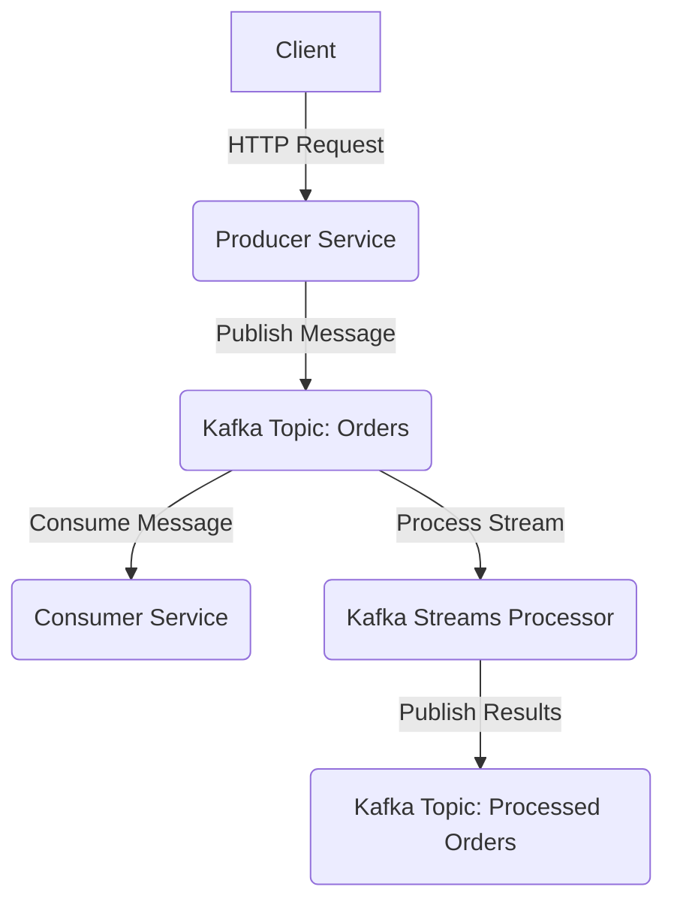
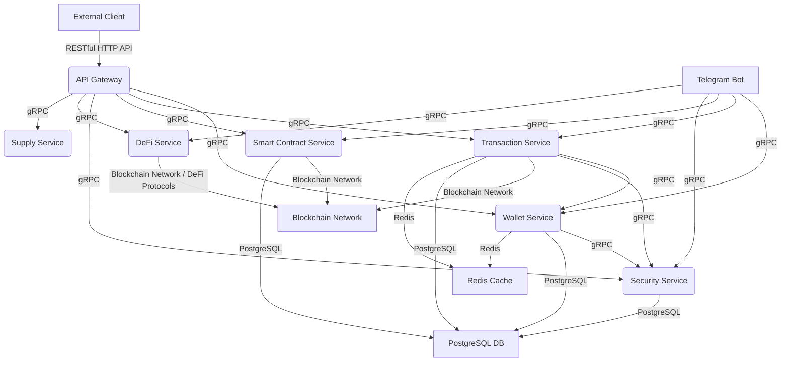

# Detailed Architecture Analysis of "Go Coffee Co." Project

## 1. Detailed Architecture

The "Go Coffee Co." project consists of two main systems: **Coffee Order System** and **Web3 Wallet Backend**, which interact with each other.

### 1.1. Coffee Order System

This system is implemented as a microservice architecture with asynchronous communication via Kafka.

*   **Producer Service**:
    *   **Description**: An HTTP server that provides a REST API for placing coffee orders.
    *   **Components**: `Main` (entry point), `Config` (configuration management), `Handler` (HTTP request handlers), `Kafka` (abstraction for Kafka interaction), `Middleware` (logging, request ID generation, CORS, error recovery).
    *   **Interaction**: Receives HTTP requests, processes them through a middleware chain, publishes order messages to Kafka.

*   **Consumer Service**:
    *   **Description**: A worker service that consumes messages from Kafka and processes them.
    *   **Components**: `Main` (entry point), `Config` (configuration management), `Kafka` (abstraction for Kafka interaction).
    *   **Interaction**: Connects to Kafka, subscribes to a topic, processes received messages.

*   **Streams Processor (Kafka Streams)**:
    *   **Description**: A component that processes data streams from Kafka, performing real-time aggregation, transformation, or data analysis.
    *   **Interaction**: Consumes data from one or more Kafka topics, processes it, and can publish results to other Kafka topics.

*   **Accounts Service**:
    *   **Description**: A service that manages user accounts.
    *   **Interaction**: Can interact with other services to manage user data.

### 1.2. Web3 Wallet Backend

This system is also built on a microservice architecture, focused on Web3 operations.

*   **API Gateway**:
    *   **Description**: A single entry point for all client requests to the Web3 Wallet Backend.
    *   **Functionality**: Authentication and authorization, routing requests to appropriate services, rate limiting, CORS handling, request/response logging, error handling.
    *   **Interaction**: Provides a RESTful API for external clients and communicates with internal services using gRPC.

*   **Wallet Service**:
    *   **Description**: Manages all wallet-related operations.
    *   **Functionality**: Wallet creation, wallet import/export, balance checking, key management.
    *   **Interaction**: Stores wallet metadata in a database and securely manages private keys using the Security Service.

*   **Transaction Service**:
    *   **Description**: Processes all transaction-related operations.
    *   **Functionality**: Transaction creation, transaction status tracking, gas estimation, gas price retrieval, transaction receipt retrieval.
    *   **Interaction**: Interacts with various blockchain networks to send and track transactions.

*   **Smart Contract Service**:
    *   **Description**: Manages all smart contract-related operations.
    *   **Functionality**: Contract deployment, contract method calls, contract event monitoring, token information retrieval.
    *   **Interaction**: Interacts with various blockchain networks for deploying and interacting with smart contracts.

*   **Security Service**:
    *   **Description**: Provides security-related operations.
    *   **Functionality**: Key pair generation, private key encryption/decryption, JWT token generation/verification, mnemonic phrase generation/validation, mnemonic phrase to private key conversion.
    *   **Interaction**: Ensures secure execution of sensitive cryptographic operations.

*   **DeFi Service**:
    *   **Description**: Manages decentralized finance (DeFi) related operations.
    *   **Functionality**: Includes `onchain_analyzer`, `oneinch_client`, `raydium`, `trading_bot`, `uniswap_client`, `yield_aggregator`, `aave_client`, `arbitrage_detector`, `chainlink_client`, `jupiter`, `coffee_token`.
    *   **Interaction**: Interacts with various DeFi protocols and blockchain networks to perform DeFi operations.

*   **Supply Service**:
    *   **Description**: Manages logic related to supply or inventory, possibly for physical goods (coffee) or digital assets.
    *   **Interaction**: Can interact with a database to manage supply data.

*   **Telegram Bot**:
    *   **Description**: A component that provides user interaction via Telegram.
    *   **Interaction**: Uses the `go-telegram-bot-api` library to handle commands and interact with the Telegram API. Can call other Web3 Wallet Backend services to perform operations.

## 2. Technology Stack Definition

*   **Programming Languages**:
    *   Go (primary language for all microservices)
    *   Solidity (for smart contracts, e.g., `CoffeeToken.sol`)

*   **Databases**:
    *   PostgreSQL (for storing data such as users, wallets, transactions, contracts, contract events)
    *   Redis (for caching frequently accessed data, such as wallet balances and transaction statuses)

*   **Message Queues**:
    *   Apache Kafka (as a message broker for asynchronous communication between Producer and Consumer Service, and for Kafka Streams)

*   **Deployment Tools and Infrastructure as Code (IaC)**:
    *   Docker (for containerizing services)
    *   Kubernetes (for container orchestration in production environments, including auto-scaling, self-healing, updates)
    *   Terraform (for managing cloud infrastructure, including GKE, Kafka, monitoring, networking)
    *   Helm (for managing Kubernetes packages, simplifying application deployment and configuration)
    *   Google Cloud Platform (GCP) (as a cloud provider, mentioned in Terraform modules)

*   **Monitoring and Observability Tools**:
    *   Prometheus (for metric collection)
    *   Grafana (for metric visualization and dashboards)
    *   Alertmanager (for alert management)
    *   Structured Logging (with correlation IDs)
    *   Distributed Tracing (possible integration with Jaeger, Zipkin)

*   **Blockchain Technologies and DeFi**:
    *   Ethereum (network support)
    *   Binance Smart Chain (network support)
    *   Polygon (network support)
    *   Solana (mentioned integration)
    *   CoffeeToken.sol (example smart contract)
    *   DeFi protocols/clients: 1inch, Raydium, Uniswap, Aave, Chainlink, Jupiter (for interacting with the DeFi ecosystem)
    *   gRPC (for internal communication between Web3 Wallet Backend microservices)
    *   Protocol Buffers (for defining gRPC service interfaces)
    *   RESTful HTTP APIs (for external communication with API Gateway)
    *   JWT (JSON Web Tokens) (for authentication)
    *   TLS/mTLS (for secure communication)

## 3. Component Interaction Description

### 3.1. Interaction in Coffee Order System

1.  **Client** sends an HTTP request to place an order to the **Producer Service**.
2.  **Producer Service** processes the request, applies middleware (logging, CORS, etc.), and publishes an order message to the Kafka topic (`Orders`).
3.  **Consumer Service** consumes messages from the `Orders` topic and performs the necessary processing.
4.  **Kafka Streams Processor** also consumes messages from the `Orders` topic (or other topics), performs stream processing (e.g., aggregation, analytics), and publishes results to another Kafka topic (`Processed Orders`).

### 3.2. Interaction in Web3 Wallet Backend

*   **External Communication**: External clients interact with the system via the **API Gateway** using a RESTful HTTP API.
*   **Internal Communication**: All internal microservices (Wallet, Transaction, Smart Contract, Security, DeFi, Supply) communicate with each other using gRPC.
*   **Telegram Bot** also interacts with other Web3 Wallet Backend services via gRPC.
*   **Database**: Wallet, Transaction, Smart Contract, and Security services interact with the PostgreSQL database for storing and retrieving data. Redis is used for caching.
*   **Blockchain**: Transaction Service, Smart Contract Service, and DeFi Service interact with various blockchain networks and DeFi protocols.
*   **Security Service**: Plays a central role in security, providing key generation, private key encryption/decryption, and JWT token management services for other services.

### 3.3. Examples of Data Flows

**Wallet Creation Flow:**
1.  The client sends a wallet creation request to the **API Gateway**.
2.  The **API Gateway** authenticates the request and routes it to the **Wallet Service**.
3.  The **Wallet Service** requests the **Security Service** to generate a key pair.
4.  The **Security Service** generates a key pair and returns it to the **Wallet Service**.
5.  The **Wallet Service** creates a wallet record in the database.
6.  The **Wallet Service** returns wallet details to the **API Gateway**.
7.  The **API Gateway** returns wallet details to the client.

**Transaction Creation Flow:**
1.  The client sends a transaction creation request to the **API Gateway**.
2.  The **API Gateway** authenticates the request and routes it to the **Transaction Service**.
3.  The **Transaction Service** retrieves wallet details from the **Wallet Service**.
4.  The **Transaction Service** requests the **Security Service** to decrypt the private key.
5.  The **Security Service** decrypts the private key and returns it to the **Transaction Service**.
6.  The **Transaction Service** creates and signs the transaction.
7.  The **Transaction Service** sends the transaction to the blockchain.
8.  The **Transaction Service** creates a transaction record in the database.
9.  The **Transaction Service** returns transaction details to the **API Gateway**.
10. The **API Gateway** returns transaction details to the client.