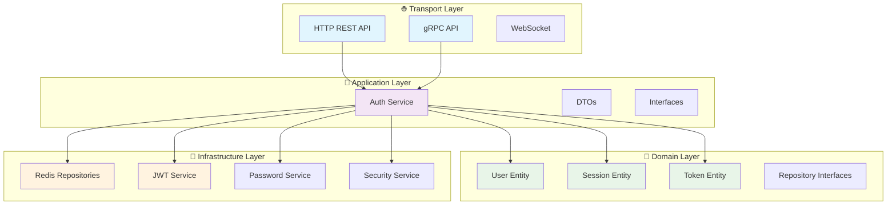
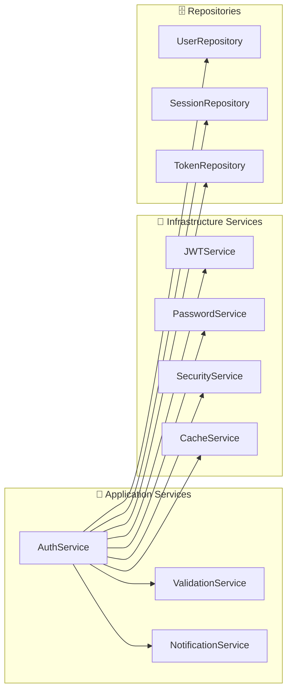
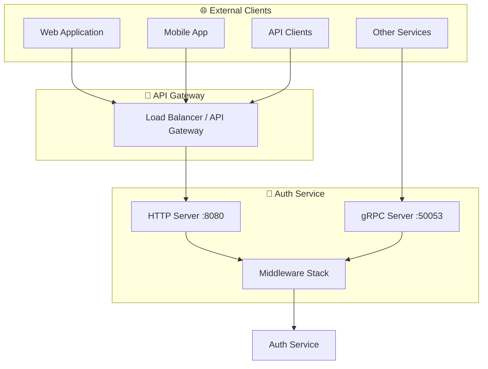
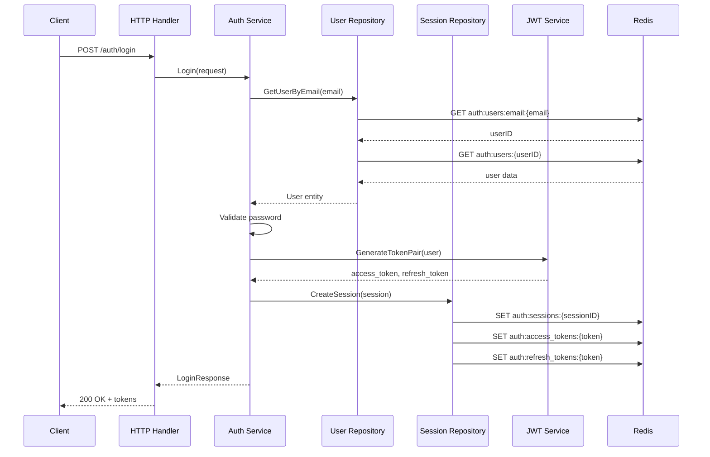
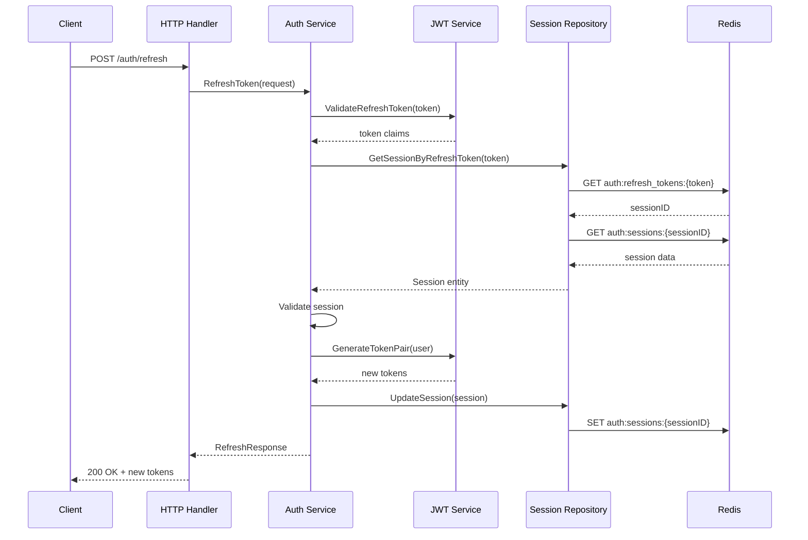
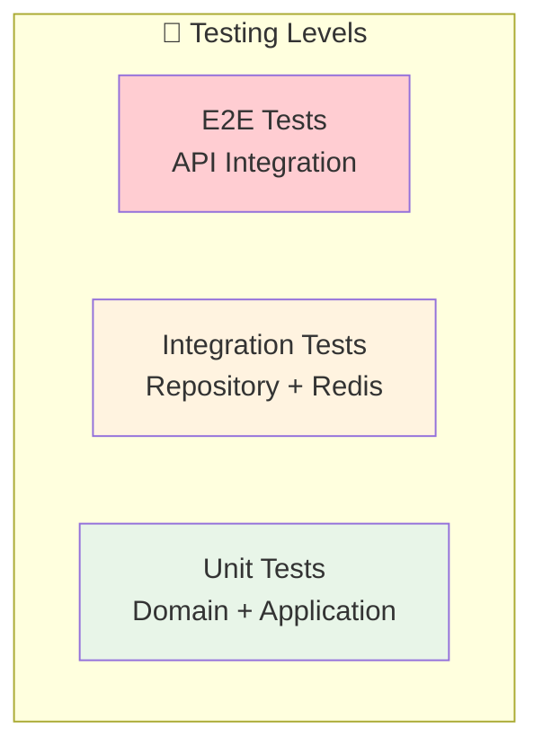

# 🏗️ Auth Service Architecture Guide

<div align="center">


**Enterprise-grade microservice architecture following Clean Architecture and DDD principles**

</div>

---

## 🎯 Architecture Overview

The Auth Service follows **Clean Architecture** principles with clear separation of concerns and dependency inversion. The architecture is designed to be:

- **🔄 Maintainable** - Easy to modify and extend
- **🧪 Testable** - High test coverage with isolated units
- **🔌 Flexible** - Pluggable components and interfaces
- **📈 Scalable** - Horizontal scaling capabilities

---

## 🏛️ Layer Architecture



---

## 📦 Domain Layer

### 🎯 Core Entities

<table>
<tr>
<td width="33%">

**👤 User Entity**
```go
type User struct {
    ID                string
    Email             string
    PasswordHash      string
    Role              UserRole
    Status            UserStatus
    FailedLoginCount  int
    LastLoginAt       *time.Time
    LockedUntil       *time.Time
    CreatedAt         time.Time
    UpdatedAt         time.Time
}
```

</td>
<td width="33%">

**🔐 Session Entity**
```go
type Session struct {
    ID               string
    UserID           string
    AccessToken      string
    RefreshToken     string
    Status           SessionStatus
    ExpiresAt        time.Time
    RefreshExpiresAt time.Time
    DeviceInfo       *DeviceInfo
    CreatedAt        time.Time
    UpdatedAt        time.Time
}
```

</td>
<td width="33%">

**🎫 Token Entity**
```go
type Token struct {
    ID        string
    UserID    string
    SessionID string
    Type      TokenType
    Status    TokenStatus
    Value     string
    ExpiresAt time.Time
    IssuedAt  time.Time
    CreatedAt time.Time
}
```

</td>
</tr>
</table>

### 🔄 Business Rules

<details>
<summary><b>👤 User Business Rules</b></summary>

- **Email Validation**: Must be valid email format
- **Password Policy**: Minimum 8 chars, mixed case, numbers, symbols
- **Account Locking**: Lock after 5 failed login attempts
- **Status Management**: Active, inactive, locked, suspended states
- **Role Assignment**: User, admin roles with different permissions

</details>

<details>
<summary><b>🔐 Session Business Rules</b></summary>

- **Single User, Multiple Sessions**: Users can have multiple active sessions
- **Session Expiration**: Access tokens expire in 15 minutes
- **Refresh Token Lifecycle**: Refresh tokens expire in 7 days
- **Device Tracking**: Track device information for security
- **Session Revocation**: Can revoke individual or all sessions

</details>

<details>
<summary><b>🎫 Token Business Rules</b></summary>

- **JWT Structure**: Header, payload, signature with HS256
- **Claims Validation**: User ID, email, role, session ID, expiration
- **Token Types**: Access tokens for API calls, refresh for renewal
- **Blacklisting**: Revoked tokens added to blacklist
- **Signature Verification**: All tokens must have valid signatures

</details>

---

## 🎯 Application Layer

### 🔧 Service Architecture



### 📋 Use Cases

<table>
<tr>
<td width="50%">

**🔑 Authentication Use Cases**
- ✅ Register new user
- ✅ Login with credentials
- ✅ Logout and revoke session
- ✅ Change password
- ✅ Validate user status

</td>
<td width="50%">

**🎫 Token Management Use Cases**
- ✅ Generate JWT token pair
- ✅ Validate access token
- ✅ Refresh expired token
- ✅ Revoke tokens
- ✅ Blacklist management

</td>
</tr>
<tr>
<td width="50%">

**🔐 Session Management Use Cases**
- ✅ Create user session
- ✅ Track session activity
- ✅ Manage multiple sessions
- ✅ Session cleanup
- ✅ Device tracking

</td>
<td width="50%">

**🛡️ Security Use Cases**
- ✅ Rate limiting
- ✅ Account lockout
- ✅ Security event logging
- ✅ Failed login tracking
- ✅ Suspicious activity detection

</td>
</tr>
</table>

---

## 🔧 Infrastructure Layer

### 🗄️ Data Storage Architecture

```mermaid
graph TB
    subgraph "📊 Redis Data Store"
        subgraph "👤 User Data"
            U1[auth:users:{userID}]
            U2[auth:users:email:{email}]
        end
        
        subgraph "🔐 Session Data"
            S1[auth:sessions:{sessionID}]
            S2[auth:access_tokens:{token}]
            S3[auth:refresh_tokens:{token}]
            S4[auth:user_sessions:{userID}]
        end
        
        subgraph "🛡️ Security Data"
            SEC1[auth:failed_login:{email}]
            SEC2[auth:blacklist:{tokenID}]
            SEC3[auth:rate_limit:{key}]
        end
    end
    
    subgraph "🔌 Repository Layer"
        UR[UserRepository]
        SR[SessionRepository]
        TR[TokenRepository]
    end
    
    UR --> U1
    UR --> U2
    SR --> S1
    SR --> S2
    SR --> S3
    SR --> S4
    TR --> SEC2
```

### 🔐 Security Services

<table>
<tr>
<td width="33%">

**🔑 JWT Service**
- Token generation
- Token validation
- Claims parsing
- Signature verification
- Expiration handling

</td>
<td width="33%">

**🔒 Password Service**
- bcrypt hashing
- Password validation
- Policy enforcement
- Strength checking
- Common password detection

</td>
<td width="33%">

**🛡️ Security Service**
- Rate limiting
- Event logging
- Account lockout
- Failed login tracking
- Suspicious activity detection

</td>
</tr>
</table>

---

## 🌐 Transport Layer

### 🔄 API Architecture



### 🔧 Middleware Stack

<table>
<tr>
<td width="25%">

**📊 Logging**
- Request/response logging
- Structured logging
- Correlation IDs
- Performance metrics

</td>
<td width="25%">

**🛡️ Security**
- CORS handling
- Security headers
- Rate limiting
- Input validation

</td>
<td width="25%">

**📈 Monitoring**
- Prometheus metrics
- Health checks
- Distributed tracing
- Error tracking

</td>
<td width="25%">

**🔄 Recovery**
- Panic recovery
- Graceful degradation
- Circuit breakers
- Retry mechanisms

</td>
</tr>
</table>

---

## 🔄 Data Flow

### 🔐 Authentication Flow



### 🔄 Token Refresh Flow



---

## 🔌 Dependency Injection

### 🏗️ Service Construction

```go
// Main service initialization
func InitializeAuthService() *AuthService {
    // Infrastructure
    redisClient := initRedis()
    logger := initLogger()
    
    // Repositories
    userRepo := repository.NewRedisUserRepository(redisClient, logger)
    sessionRepo := repository.NewRedisSessionRepository(redisClient, logger)
    
    // Services
    jwtService := security.NewJWTService(jwtConfig, logger)
    passwordService := security.NewPasswordService(passwordConfig, logger)
    securityService := security.NewSecurityService(securityConfig, logger)
    
    // Application service
    return application.NewAuthService(
        userRepo,
        sessionRepo,
        jwtService,
        passwordService,
        securityService,
        authConfig,
        logger,
    )
}
```

### 🔄 Interface Segregation

```go
// Small, focused interfaces
type UserRepository interface {
    CreateUser(ctx context.Context, user *User) error
    GetUserByEmail(ctx context.Context, email string) (*User, error)
    UpdateUser(ctx context.Context, user *User) error
}

type JWTService interface {
    GenerateAccessToken(ctx context.Context, user *User, sessionID string) (string, error)
    ValidateToken(ctx context.Context, token string) (*TokenClaims, error)
}

type PasswordService interface {
    HashPassword(password string) (string, error)
    VerifyPassword(hashedPassword, password string) error
}
```

---

## 📊 Scalability Considerations

### 🔄 Horizontal Scaling

<table>
<tr>
<td width="50%">

**✅ Stateless Design**
- No server-side sessions
- JWT tokens contain all needed info
- Redis for shared state
- Load balancer friendly

</td>
<td width="50%">

**📈 Performance Optimizations**
- Connection pooling
- Redis clustering
- Token caching
- Async operations

</td>
</tr>
<tr>
<td width="50%">

**🔄 High Availability**
- Multiple service instances
- Redis replication
- Health checks
- Graceful shutdowns

</td>
<td width="50%">

**📊 Monitoring & Observability**
- Prometheus metrics
- Distributed tracing
- Structured logging
- Performance dashboards

</td>
</tr>
</table>

---

## 🧪 Testing Strategy

### 🏗️ Testing Pyramid



### 📋 Test Coverage

- **Unit Tests**: Domain entities, application services
- **Integration Tests**: Repository implementations, external services
- **API Tests**: HTTP endpoints, request/response validation
- **Security Tests**: Authentication flows, authorization checks
- **Performance Tests**: Load testing, stress testing

---

<div align="center">

**🏗️ Architecture Documentation**

[🏠 Main README](./README.md) • [📖 API Reference](./api-reference.md) • [🛡️ Security](./security.md) • [🚀 Deployment](./deployment.md)

</div>
