# 🛡️ Auth Service Security Guide

<div align="center">


**Enterprise-grade security implementation following industry best practices**

</div>

---

## 🎯 Security Overview

The Auth Service implements multiple layers of security controls to protect against common threats and ensure data integrity. Our security model follows the **Zero Trust** principle and **Defense in Depth** strategy.

### 🔒 Security Principles

<table>
<tr>
<td width="25%">

**🔐 Authentication**
- Multi-factor capable
- Strong password policies
- Account lockout protection
- Session management

</td>
<td width="25%">

**🛡️ Authorization**
- Role-based access control
- JWT token validation
- Permission boundaries
- Least privilege principle

</td>
<td width="25%">

**🔍 Monitoring**
- Security event logging
- Anomaly detection
- Real-time alerting
- Audit trails

</td>
<td width="25%">

**🚨 Incident Response**
- Automated lockouts
- Rate limiting
- Threat detection
- Recovery procedures

</td>
</tr>
</table>

---

## 🔑 Authentication Security

### 🔒 Password Security

#### Password Policy

```yaml
password_policy:
  min_length: 8
  max_length: 128
  require_uppercase: true
  require_lowercase: true
  require_numbers: true
  require_symbols: true
  forbidden_patterns:
    - sequential_chars: true    # 123, abc
    - repeated_chars: true      # aaa, 111
    - common_passwords: true    # password, 123456
```

#### Implementation Details

<details>
<summary><b>🔐 bcrypt Hashing</b></summary>

```go
// Password hashing with bcrypt
func (p *PasswordService) HashPassword(password string) (string, error) {
    // Cost factor 12 = 2^12 iterations (4096)
    hashedBytes, err := bcrypt.GenerateFromPassword([]byte(password), 12)
    if err != nil {
        return "", err
    }
    return string(hashedBytes), nil
}
```

**Security Features:**
- **Cost Factor 12**: 4096 iterations, ~250ms computation time
- **Salt Generation**: Automatic random salt per password
- **Timing Attack Protection**: Constant-time comparison
- **Rainbow Table Protection**: Unique salt prevents precomputed attacks

</details>

<details>
<summary><b>🚫 Weak Password Detection</b></summary>

```go
// Common weak passwords check
var weakPasswords = []string{
    "password", "123456", "123456789", "qwerty", "abc123",
    "password123", "admin", "letmein", "welcome", "monkey",
}

// Sequential character detection
func hasSequentialChars(password string) bool {
    patterns := []string{"123", "234", "345", "abc", "bcd", "cde"}
    for _, pattern := range patterns {
        if strings.Contains(strings.ToLower(password), pattern) {
            return true
        }
    }
    return false
}
```

</details>

### 🔐 Account Protection

#### Failed Login Protection

<table>
<tr>
<td width="50%">

**🚨 Account Lockout Policy**
- **Threshold**: 5 failed attempts
- **Lockout Duration**: 30 minutes
- **Progressive Delays**: Exponential backoff
- **Reset Mechanism**: Automatic unlock after timeout

</td>
<td width="50%">

**📊 Tracking Implementation**
```go
type FailedLoginTracker struct {
    Email     string
    Attempts  int
    LastAttempt time.Time
    LockedUntil *time.Time
}
```

</td>
</tr>
</table>

#### Rate Limiting

```yaml
rate_limiting:
  enabled: true
  requests_per_minute: 100
  burst_size: 20
  cleanup_interval: "1m"
  
  # Specific endpoints
  endpoints:
    "/auth/login":
      requests_per_minute: 10
      burst_size: 3
    "/auth/register":
      requests_per_minute: 5
      burst_size: 2
```

---

## 🎫 JWT Token Security

### 🔐 Token Configuration

```yaml
jwt:
  algorithm: "HS256"              # HMAC SHA-256
  access_token_ttl: "15m"         # Short-lived
  refresh_token_ttl: "168h"       # 7 days
  issuer: "auth-service"
  audience: "go-coffee-users"
  secret: "${JWT_SECRET}"         # 256-bit secret
```

### 🛡️ Token Security Features

<table>
<tr>
<td width="33%">

**🔑 Token Structure**
```json
{
  "header": {
    "alg": "HS256",
    "typ": "JWT"
  },
  "payload": {
    "user_id": "user_123",
    "email": "user@example.com",
    "role": "user",
    "session_id": "session_456",
    "token_id": "token_789",
    "type": "access",
    "iat": 1642234567,
    "exp": 1642235467,
    "iss": "auth-service",
    "aud": "go-coffee-users"
  }
}
```

</td>
<td width="33%">

**⏰ Token Lifecycle**
- **Access Token**: 15 minutes
- **Refresh Token**: 7 days
- **Automatic Rotation**: New tokens on refresh
- **Revocation**: Immediate invalidation
- **Blacklisting**: Revoked tokens tracked

</td>
<td width="33%">

**🔍 Validation Process**
1. Signature verification
2. Expiration check
3. Issuer validation
4. Audience validation
5. Blacklist check
6. Session validation
7. User status check

</td>
</tr>
</table>

### 🚫 Token Revocation

```mermaid
graph TB
    subgraph "🎫 Token Revocation Flow"
        A[Token Revocation Request]
        B[Add to Blacklist]
        C[Set TTL = Token Expiry]
        D[Revoke Related Sessions]
        E[Log Security Event]
        F[Notify User]
    end
    
    A --> B
    B --> C
    C --> D
    D --> E
    E --> F
```



**Blacklist Implementation:**
```go
// Redis blacklist with automatic cleanup
func (r *TokenRepository) AddToBlacklist(ctx context.Context, tokenID string, expiresAt time.Time) error {
    key := fmt.Sprintf("auth:blacklist:%s", tokenID)
    ttl := time.Until(expiresAt)
    return r.client.Set(ctx, key, "revoked", ttl).Err()
}
```

---

## 🔐 Session Security

### 🛡️ Session Management

<table>
<tr>
<td width="50%">

**📊 Session Properties**
```go
type Session struct {
    ID               string
    UserID           string
    AccessToken      string
    RefreshToken     string
    Status           SessionStatus
    ExpiresAt        time.Time
    RefreshExpiresAt time.Time
    DeviceInfo       *DeviceInfo
    IPAddress        string
    UserAgent        string
    LastUsedAt       *time.Time
    CreatedAt        time.Time
}
```

</td>
<td width="50%">

**🔒 Security Features**
- **Device Fingerprinting**: Track device info
- **IP Address Tracking**: Monitor location changes
- **Session Limits**: Max sessions per user
- **Concurrent Session Detection**: Alert on multiple logins
- **Session Hijacking Protection**: Token binding

</td>
</tr>
</table>

### 🚨 Suspicious Activity Detection

```go
// Detect suspicious login patterns
func (s *SecurityService) DetectSuspiciousActivity(ctx context.Context, userID string, loginInfo *LoginInfo) error {
    // Check for unusual location
    if s.isUnusualLocation(userID, loginInfo.IPAddress) {
        return s.flagSuspiciousActivity("unusual_location", userID, loginInfo)
    }
    
    // Check for rapid successive logins
    if s.hasRapidLogins(userID, time.Now()) {
        return s.flagSuspiciousActivity("rapid_logins", userID, loginInfo)
    }
    
    // Check for unusual device
    if s.isUnusualDevice(userID, loginInfo.DeviceInfo) {
        return s.flagSuspiciousActivity("unusual_device", userID, loginInfo)
    }
    
    return nil
}
```

---

## 🌐 Transport Security

### 🔒 HTTPS/TLS Configuration

```yaml
tls:
  enabled: true
  cert_file: "/etc/ssl/certs/auth-service.crt"
  key_file: "/etc/ssl/private/auth-service.key"
  min_version: "1.2"
  cipher_suites:
    - "TLS_ECDHE_RSA_WITH_AES_256_GCM_SHA384"
    - "TLS_ECDHE_RSA_WITH_CHACHA20_POLY1305"
    - "TLS_ECDHE_RSA_WITH_AES_128_GCM_SHA256"
```

### 🛡️ Security Headers

```go
// Security headers middleware
func SecurityHeadersMiddleware() gin.HandlerFunc {
    return gin.HandlerFunc(func(c *gin.Context) {
        // Prevent clickjacking
        c.Header("X-Frame-Options", "DENY")
        
        // Prevent MIME type sniffing
        c.Header("X-Content-Type-Options", "nosniff")
        
        // XSS protection
        c.Header("X-XSS-Protection", "1; mode=block")
        
        // HSTS
        c.Header("Strict-Transport-Security", "max-age=31536000; includeSubDomains")
        
        // Content Security Policy
        c.Header("Content-Security-Policy", "default-src 'self'")
        
        // Referrer Policy
        c.Header("Referrer-Policy", "strict-origin-when-cross-origin")
        
        c.Next()
    })
}
```

### 🌍 CORS Configuration

```yaml
cors:
  allowed_origins: 
    - "https://app.go-coffee.com"
    - "https://admin.go-coffee.com"
  allowed_methods: ["GET", "POST", "PUT", "DELETE", "OPTIONS"]
  allowed_headers: 
    - "Origin"
    - "Content-Type"
    - "Authorization"
    - "X-Requested-With"
  expose_headers: ["Content-Length", "X-Request-ID"]
  allow_credentials: true
  max_age: 86400
```

---

## 📊 Security Monitoring

### 🔍 Security Events

<table>
<tr>
<td width="50%">

**📋 Event Types**
- `login` - Successful login
- `login_failed` - Failed login attempt
- `logout` - User logout
- `password_change` - Password changed
- `account_locked` - Account locked
- `token_refresh` - Token refreshed
- `suspicious_activity` - Anomaly detected

</td>
<td width="50%">

**📊 Event Structure**
```go
type SecurityEvent struct {
    ID          string
    UserID      string
    Type        SecurityEventType
    Severity    SecuritySeverity
    Description string
    IPAddress   string
    UserAgent   string
    Metadata    map[string]string
    CreatedAt   time.Time
}
```

</td>
</tr>
</table>

### 🚨 Real-time Alerting

```yaml
alerting:
  rules:
    - name: "High Failed Login Rate"
      condition: "failed_logins > 10 in 5m"
      severity: "high"
      action: "notify_security_team"
      
    - name: "Account Lockout Spike"
      condition: "account_lockouts > 5 in 10m"
      severity: "critical"
      action: "escalate_to_oncall"
      
    - name: "Suspicious Activity"
      condition: "suspicious_events > 3 in 15m"
      severity: "medium"
      action: "log_and_monitor"
```

### 📈 Security Metrics

```prometheus
# Failed login attempts
auth_failed_logins_total{reason="invalid_password"} 45
auth_failed_logins_total{reason="account_locked"} 12

# Account security
auth_accounts_locked_total 8
auth_suspicious_activities_total{type="unusual_location"} 3

# Token security
auth_tokens_revoked_total{reason="logout"} 156
auth_tokens_blacklisted_total 23
```

---

## 🔧 Security Configuration

### 🛡️ Environment Variables

```bash
# JWT Security
JWT_SECRET=your-256-bit-secret-key-here
JWT_ACCESS_TTL=15m
JWT_REFRESH_TTL=168h

# Password Security
BCRYPT_COST=12
PASSWORD_MIN_LENGTH=8

# Rate Limiting
RATE_LIMIT_ENABLED=true
RATE_LIMIT_RPM=100

# Account Security
MAX_LOGIN_ATTEMPTS=5
LOCKOUT_DURATION=30m

# Monitoring
SECURITY_LOGGING_ENABLED=true
ALERT_WEBHOOK_URL=https://alerts.company.com/webhook
```

### 🔒 Production Security Checklist

<table>
<tr>
<td width="50%">

**✅ Authentication**
- [ ] Strong JWT secret (256+ bits)
- [ ] Secure password policy
- [ ] Account lockout enabled
- [ ] Rate limiting configured
- [ ] Session timeout set

</td>
<td width="50%">

**✅ Infrastructure**
- [ ] HTTPS/TLS enabled
- [ ] Security headers configured
- [ ] CORS properly set
- [ ] Redis authentication enabled
- [ ] Network segmentation

</td>
</tr>
<tr>
<td width="50%">

**✅ Monitoring**
- [ ] Security event logging
- [ ] Real-time alerting
- [ ] Metrics collection
- [ ] Audit trail enabled
- [ ] Incident response plan

</td>
<td width="50%">

**✅ Compliance**
- [ ] Data encryption at rest
- [ ] Data encryption in transit
- [ ] Access logging
- [ ] Regular security audits
- [ ] Vulnerability scanning

</td>
</tr>
</table>

---

## 🚨 Incident Response

### 🔍 Security Incident Types

<table>
<tr>
<td width="33%">

**🚨 High Severity**
- Unauthorized access
- Data breach
- System compromise
- Mass account lockouts

</td>
<td width="33%">

**⚠️ Medium Severity**
- Suspicious activity patterns
- Failed authentication spikes
- Unusual login locations
- Token abuse

</td>
<td width="33%">

**ℹ️ Low Severity**
- Individual account lockouts
- Password policy violations
- Rate limit exceeded
- Normal failed logins

</td>
</tr>
</table>

### 🔧 Response Procedures


---

## 📚 Security Best Practices

### 🔒 Development Guidelines

1. **Never log sensitive data** (passwords, tokens, PII)
2. **Use parameterized queries** to prevent injection
3. **Validate all inputs** at API boundaries
4. **Implement proper error handling** without information leakage
5. **Use secure random generators** for tokens and salts
6. **Regular security testing** and code reviews
7. **Keep dependencies updated** and scan for vulnerabilities

### 🛡️ Operational Security

1. **Regular security audits** and penetration testing
2. **Monitor security metrics** and set up alerts
3. **Implement proper backup** and disaster recovery
4. **Use secrets management** for sensitive configuration
5. **Network segmentation** and firewall rules
6. **Regular security training** for development team

---

<div align="center">

**🛡️ Security Documentation**

[🏠 Main README](./README.md) • [📖 API Reference](./api-reference.md) • [🏗️ Architecture](./architecture.md) • [🚀 Deployment](./deployment.md)

</div>
