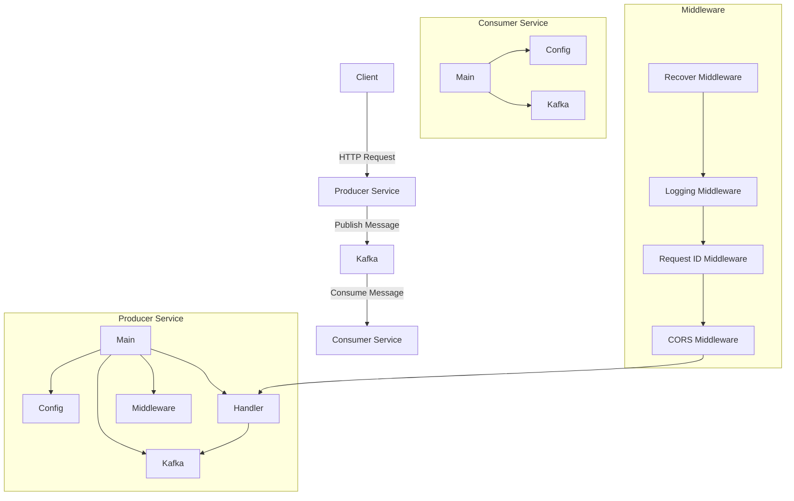

Ця діаграма показує архітектуру системи замовлення кави. Клієнт надсилає HTTP-запит до Producer Service, який публікує повідомлення в Kafka. Consumer Service споживає повідомлення з Kafka та обробляє їх.

Producer Service складається з наступних компонентів:

- Main: Точка входу в додаток
- Config: Управління конфігурацією
- Handler: Обробники HTTP-запитів
- Kafka: Абстракція для взаємодії з Kafka
- Middleware: HTTP-middleware для логування, генерації ID запиту, підтримки CORS та обробки помилок

Consumer Service складається з наступних компонентів:

- Main: Точка входу в додаток
- Config: Управління конфігурацією
- Kafka: Абстракція для взаємодії з Kafka

Middleware складається з наступних компонентів:

- Recover Middleware: Перехоплює паніки та повертає помилку 500
- Logging Middleware: Логує деталі запиту
- Request ID Middleware: Призначає унікальний ID для запиту
- CORS Middleware: Додає CORS-заголовки до відповіді
