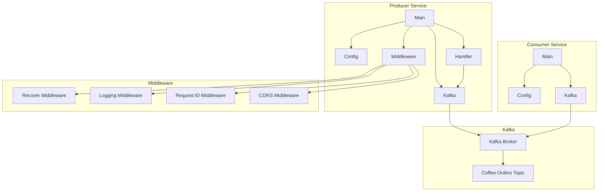

Ця діаграма компонентів показує структуру системи замовлення кави та взаємозв'язки між компонентами:

**Producer Service**:
- Main: Точка входу в додаток, ініціалізує компоненти та запускає HTTP-сервер
- Config: Управляє конфігурацією додатку з змінних середовища та файлів конфігурації
- Handler: Містить HTTP-обробники для обробки запитів
- Kafka: Надає абстракцію для взаємодії з Kafka
- Middleware: Містить HTTP-middleware для логування, генерації ID запиту, підтримки CORS та обробки помилок

**Consumer Service**:
- Main: Точка входу в додаток, ініціалізує компоненти та запускає споживача
- Config: Управляє конфігурацією додатку з змінних середовища та файлів конфігурації
- Kafka: Надає абстракцію для взаємодії з Kafka

**Middleware**:
- Recover Middleware: Перехоплює паніки та повертає помилку 500
- Logging Middleware: Логує деталі запиту
- Request ID Middleware: Призначає унікальний ID для запиту
- CORS Middleware: Додає CORS-заголовки до відповіді

**Kafka**:
- Kafka Broker: Сервер Kafka
- Coffee Orders Topic: Тема Kafka для замовлень кави
