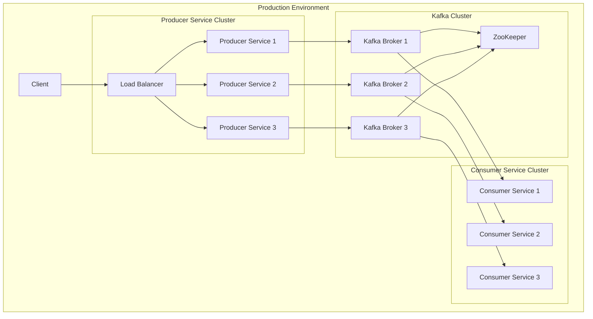

Ця діаграма розгортання показує, як система замовлення кави може бути розгорнута в продакшн-середовищі:

**Producer Service Cluster**:
- Кілька екземплярів Producer Service для обробки високого навантаження
- Load Balancer для розподілу запитів між екземплярами

**Consumer Service Cluster**:
- Кілька екземплярів Consumer Service для паралельної обробки повідомлень
- Кожен екземпляр споживає повідомлення з певної партиції Kafka

**Kafka Cluster**:
- Кілька брокерів Kafka для забезпечення високої доступності та масштабованості
- ZooKeeper для координації кластера Kafka

**Потік даних**:
1. Клієнт надсилає запит до Load Balancer
2. Load Balancer перенаправляє запит до одного з екземплярів Producer Service
3. Producer Service публікує повідомлення в Kafka
4. Kafka розподіляє повідомлення між брокерами
5. Consumer Service споживає повідомлення з Kafka та обробляє їх

Ця архітектура забезпечує:
- **Високу доступність**: Якщо один з компонентів виходить з ладу, система продовжує працювати
- **Масштабованість**: Можна додавати більше екземплярів Producer Service або Consumer Service для обробки більшого навантаження
- **Надійність**: Повідомлення зберігаються в Kafka, тому вони не втрачаються, якщо Consumer Service тимчасово недоступний
