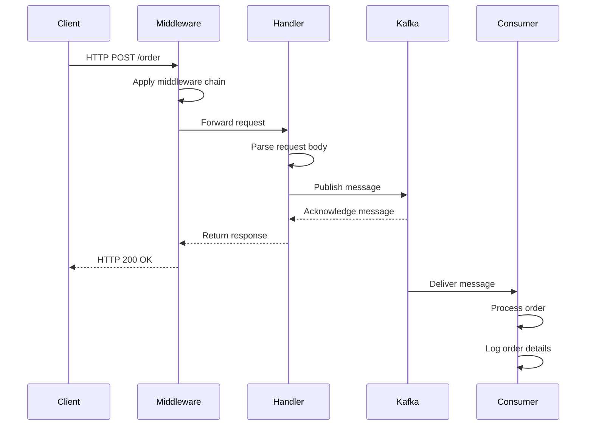

Ця діаграма послідовності показує потік обробки замовлення кави в системі:

1. Клієнт надсилає HTTP POST запит на `/order` до Producer Service.
2. Запит проходить через ланцюг middleware:
   - Recover Middleware: Перехоплює паніки
   - Logging Middleware: Логує деталі запиту
   - Request ID Middleware: Призначає унікальний ID для запиту
   - CORS Middleware: Додає CORS-заголовки до відповіді
3. Запит передається до обробника.
4. Обробник розбирає тіло запиту.
5. Обробник публікує повідомлення в Kafka.
6. Kafka підтверджує отримання повідомлення.
7. Обробник повертає відповідь клієнту.
8. Kafka доставляє повідомлення до Consumer Service.
9. Consumer Service обробляє замовлення.
10. Consumer Service логує деталі замовлення.
