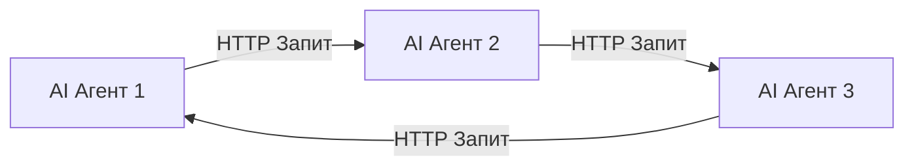
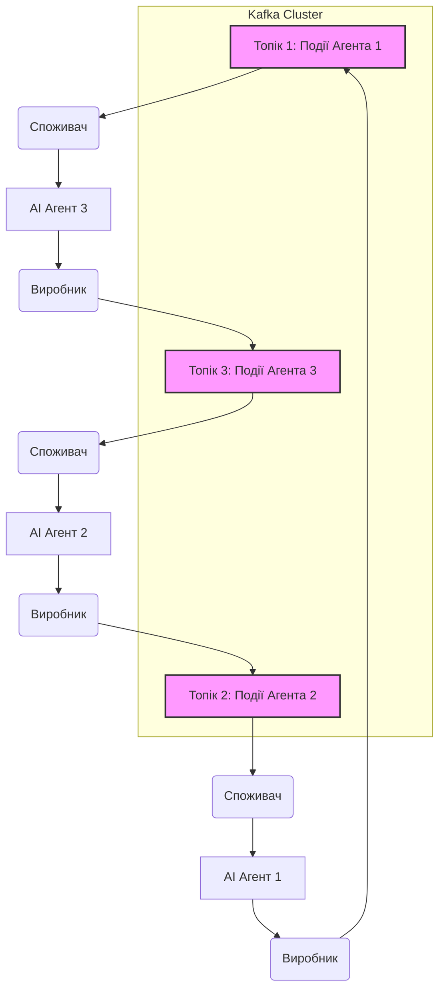

# AI Agent Interaction Improvement Plan for "Go Coffee Co." Ecosystem

## 1. Current Interaction Analysis

**Current Situation:** Interaction between AI agents is simulated or occurs through direct HTTP requests to fixed URLs.

**Strengths:**
*   **Implementation Simplicity:** For a small number of agents and simple interaction scenarios, direct HTTP requests are a quick and easy way to establish communication.
*   **Clarity:** Direct calls are easy to track and debug in simple systems.

**Weaknesses:**
*   **Scalability:** As the number of agents and interaction volume increases, direct HTTP requests can become a bottleneck. Each agent must know the URL of another agent, complicating management.
*   **Reliability:** Lack of built-in retry mechanisms or message queues. If the receiving agent is unavailable, the request will fail, potentially leading to data loss or process failure.
*   **Flexibility and Decoupling:** Agents are tightly coupled. Changes to one agent's API require updates to all agents that interact with it. This complicates independent deployment and development.
*   **Asynchronicity:** Direct HTTP requests are typically synchronous, which can lead to blocking agents waiting for responses. This is inefficient for long-running operations or when immediate response is not needed.
*   **Observability:** More difficult to track the complete interaction flow between agents, as each request is a separate transaction.

## 2. Пропозиція механізмів покращення та обґрунтування вибору

Враховуючи, що **Kafka вже присутня в проекті**, її використання як централізованого брокера повідомлень є найбільш логічним та ефективним рішенням для "Go Coffee Co.".

**Переваги Kafka для "Go Coffee Co.":**
*   **Масштабованість:** Kafka розроблена для обробки великих обсягів даних та високої пропускної здатності, що дозволить легко масштабувати взаємодію між агентами в міру зростання екосистеми.
*   **Надійність:** Повідомлення зберігаються в розподіленому, реплікованому лозі, що гарантує їхню збереженість навіть у разі збоїв агентів. Механізми споживчих груп дозволяють надійно обробляти повідомлення.
*   **Гнучкість та розв'язність:** Агенти взаємодіють через топіки, не знаючи про конкретних виробників чи споживачів. Це значно зменшує залежність між агентами, дозволяючи їм розвиватися та розгортатися незалежно.
*   **Асинхронна взаємодія:** Kafka природно підтримує асинхронну модель, що дозволяє агентам надсилати повідомлення та продовжувати свою роботу, не чекаючи на відповідь. Це покращує продуктивність та відгук системи.
*   **Існуючий технологічний стек:** Використання вже інтегрованої технології зменшує витрати на навчання, розробку та підтримку, оскільки команда вже має досвід роботи з Kafka.
*   **Потокова обробка:** Kafka Streams дозволяє легко реалізовувати складні сценарії потокової обробки даних, що може бути корисним для аналізу взаємодії агентів або створення нових функціональних можливостей.

## 3. Опис змін в архітектурі

Поточна архітектура:

**Запропонована архітектура з Kafka:**

Кожен AI-агент буде перетворений на мікросервіс, який взаємодіє з іншими агентами через Kafka топіки. Агенти стануть або **виробниками (Producers)**, які надсилають повідомлення до топіків, або **споживачами (Consumers)**, які читають повідомлення з топіків, або обома.

**Ключові зміни:**
*   **Відсутність прямих HTTP-запитів між агентами:** Агенти більше не будуть викликати один одного безпосередньо.
*   **Визначення топіків Kafka:** Для кожного типу взаємодії або для кожного агента, який генерує події, буде створено відповідний топік Kafka. Наприклад, `agent1-events`, `inventory-updates`, `social-media-posts`.
*   **Агенти як виробники:** Коли агент хоче повідомити про подію або надіслати дані іншому агенту, він публікує повідомлення до відповідного топіку Kafka.
*   **Агенти як споживачі:** Коли агент потребує інформації або повинен реагувати на подію від іншого агента, він підписується на відповідний топік Kafka та споживає повідомлення.
*   **Схема повідомлень (Event Schema):** Буде розроблена чітка схема для кожного типу повідомлень, що передаються через Kafka (наприклад, за допомогою Avro або Protobuf), щоб забезпечити сумісність та легкість обробки.
*   **Обробка помилок та повторні спроби:** Вбудовані механізми Kafka та бібліотек-клієнтів дозволять реалізувати надійну обробку помилок, повторні спроби та, за необхідності, черги "мертвих" повідомлень (Dead Letter Queues).
*   **Моніторинг:** Моніторинг Kafka топіків та споживчих груп стане ключовим для відстеження потоку даних та продуктивності системи.

## 4. Ключові кроки реалізації

1.  **Визначення подій та схем повідомлень:**
    *   Проаналізувати всі існуючі прямі HTTP-взаємодії між агентами.
    *   Для кожної взаємодії визначити відповідну "подію" (event) та її структуру (схему). Наприклад, "InventoryUpdatedEvent", "NewBeverageInventedEvent".
    *   Вибрати формат серіалізації (наприклад, JSON, Avro, Protobuf) та створити відповідні схеми.

2.  **Створення Kafka топіків:**
    *   На основі визначених подій створити необхідні топіки в Kafka.
    *   Визначити відповідні налаштування для кожного топіка (кількість розділів, коефіцієнт реплікації, політики збереження).

3.  **Модифікація існуючих AI-агентів:**
    *   **Для агентів-виробників:**
        *   Інтегрувати Kafka Producer API в код агента.
        *   Замінити прямі HTTP-запити на публікацію повідомлень до відповідних Kafka топіків.
        *   Серіалізувати дані відповідно до визначених схем.
    *   **Для агентів-споживачів:**
        *   Інтегрувати Kafka Consumer API в код агента.
        *   Підписатися на відповідні Kafka топіки.
        *   Десеріалізувати отримані повідомлення та обробляти їх.
        *   Реалізувати механізми обробки помилок та повторних спроб (наприклад, за допомогою `sarama` або `confluent-kafka-go` бібліотек для Go).

4.  **Оновлення інфраструктури та розгортання:**
    *   Переконатися, що Kafka кластер налаштований належним чином (якщо він ще не повністю функціонує).
    *   Оновити конфігурації розгортання агентів (наприклад, Kubernetes маніфести), щоб вони мали доступ до Kafka брокерів.
    *   Забезпечити належне управління секретами для підключення до Kafka.

5.  **Впровадження моніторингу та логування:**
    *   Налаштувати моніторинг для Kafka (метрики виробників, споживачів, топіків).
    *   Впровадити централізоване логування для всіх агентів, щоб відстежувати потік повідомлень та виявляти проблеми.
    *   Розглянути використання розподіленого трасування (наприклад, OpenTelemetry) для відстеження повного життєвого циклу події через кілька агентів.

6.  **Тестування:**
    *   Ретельне модульне, інтеграційне та системне тестування для перевірки коректності взаємодії через Kafka.
    *   Навантажувальне тестування для оцінки продуктивності та масштабованості нової архітектури.

7.  **Поетапна міграція (за необхідності):**
    *   Для складних систем можна розглянути поетапну міграцію, де нові взаємодії реалізуються через Kafka, а існуючі поступово переносяться.